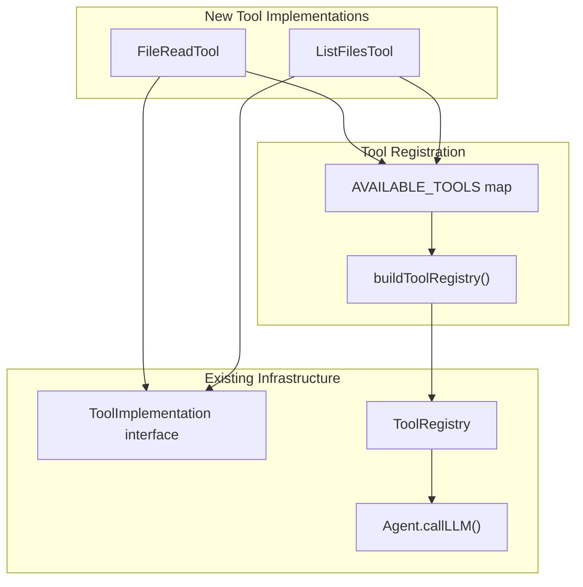

# File System Tools Implementation

## Architecture Overview



## Implementation Details

### 1. Create `file_read` Tool

**File**: [`packages/core/src/tools/file-read-tool.ts`](packages/core/src/tools/file-read-tool.ts)

- Implement `ToolImplementation` interface following [`context-search-tool.ts`](packages/core/src/tools/context-search-tool.ts) pattern
- **Input**: `{ path: string }` - absolute path to the file
- **Success output**: `{ status: "success", result: { content: string } }`
- **Error output**: `{ status: "error", error: string }` with descriptive messages for:
  - File not found (`ENOENT`)
  - Path is a directory, not a file
  - Permission denied (`EACCES`)
  - Other file system errors

### 2. Create `list_files` Tool

**File**: [`packages/core/src/tools/list-files-tool.ts`](packages/core/src/tools/list-files-tool.ts)

- Implement `ToolImplementation` interface
- **Input**: `{ path: string }` - absolute path to directory
- **Success output**: 
```json
{
  "status": "success",
  "result": {
    "entries": [
      { "path": "/absolute/path/to/file.txt", "type": "file" },
      { "path": "/absolute/path/to/subdir", "type": "directory" }
    ]
  }
}
```

- **Error output**: `{ status: "error", error: string }` with descriptive messages for:
  - Directory not found (`ENOENT`)
  - Path is a file, not a directory
  - Permission denied (`EACCES`)
  - Other file system errors

### 3. Register Tools

**File**: [`packages/core/src/utils/tool-registry-builder.ts`](packages/core/src/utils/tool-registry-builder.ts)

Add both tools to `AVAILABLE_TOOLS` map:

```typescript
const AVAILABLE_TOOLS: Record<string, ToolDefinition> = {
  context_search: { ... },
  file_read: {
    schema: { name: 'file_read', description: '...', parameters: { ... } },
    createImplementation: () => new FileReadTool(),
  },
  list_files: {
    schema: { name: 'list_files', description: '...', parameters: { ... } },
    createImplementation: () => new ListFilesTool(),
  },
};
```

### 4. Export from Package

**File**: [`packages/core/src/index.ts`](packages/core/src/index.ts)

Add exports for both new tool classes.

### 5. Update Documentation

**File**: [`docs/tools.md`](docs/tools.md)

Document both tools with:

- Description
- Input schema
- Output schema
- Example usage
- Error handling behavior

### 6. Test Files (Target: >95% Coverage)

**File**: `packages/core/src/tools/file-read-tool.spec.ts`

- Test cases:
  - Tool schema validation
  - Successful file read
  - File not found error
  - Permission denied error (if testable)
  - Path is directory error
  - Empty file handling
  - Binary file handling (returns content as-is)
  - Missing/invalid arguments

**File**: `packages/core/src/tools/list-files-tool.spec.ts`

- Test cases:
  - Tool schema validation
  - Successful directory listing with files and directories
  - Empty directory
  - Directory not found error
  - Permission denied error (if testable)
  - Path is file error
  - Missing/invalid arguments
  - Absolute path verification in output

**File**: Update [`packages/core/src/utils/tool-registry-builder.spec.ts`](packages/core/src/utils/tool-registry-builder.spec.ts)

- Add tests for registering `file_read` and `list_files` tools