# Debate Flow Documentation

This document provides a detailed explanation of the execution flow for the debate command, from CLI invocation through to final output.

## Overview

The debate system orchestrates multi-agent discussions to solve software design problems. The flow involves configuration loading, agent initialization, an optional pre-debate clarifications phase, multiple debate rounds (each executing proposal, critique, and refinement phases), judge synthesis, and result output. Each round is a complete cycle where agents propose solutions, critique each other's proposals, and refine their own proposals based on feedback.

## Sequence Diagram

The following diagram illustrates the complete flow of a debate execution:

```mermaid
sequenceDiagram
    participant CLI as CLI Entry Point
    participant Cmd as debateCommand
    participant Config as loadConfig
    participant Builder as buildAgents
    participant Provider as OpenAIProvider
    participant Agents as Agent Instances
    participant Judge as JudgeAgent
    participant SM as StateManager
    participant Orch as DebateOrchestrator
    participant FS as File System

    CLI->>Cmd: runCli(argv)
    Cmd->>Cmd: parse arguments
    Cmd->>Cmd: resolveProblemDescription(problem, options)
    alt problem from string
        Cmd->>Cmd: trim and return string
    else problem from file
        Cmd->>FS: validate file exists
        Cmd->>FS: read file content (UTF-8)
        Cmd->>Cmd: validate content non-empty
    end
    opt context file provided (--context)
        Cmd->>Cmd: readContextFile(contextPath)
        Cmd->>FS: validate file exists
        alt file valid
            Cmd->>FS: read file content (UTF-8)
            Cmd->>Cmd: trim and truncate if > 5000 chars
            Cmd->>Cmd: return context string
        else file invalid
            Cmd->>CLI: warn and return undefined
        end
    end
    Cmd->>Cmd: validate API key
    Cmd->>Config: loadConfig(configPath)
    Config->>FS: read config file
    Config-->>Cmd: SystemConfig
    Cmd->>Cmd: debateConfigFromSysConfig()
    Cmd->>Cmd: agentConfigsFromSysConfig()
    Cmd->>Provider: new OpenAIProvider(apiKey)
    Cmd->>Builder: buildAgents(configs, provider)
    Builder->>Agents: RoleBasedAgent.create() (for each role)
    Builder-->>Cmd: agents[]
    Cmd->>Judge: new JudgeAgent(config, provider)
    Cmd->>SM: new StateManager()
    SM->>FS: ensure debates/ directory exists
    Cmd->>Orch: new DebateOrchestrator(agents, judge, sm, config)
    
    opt clarifications enabled (--clarify or config.interactiveClarifications)
        Cmd->>Cmd: collectClarifications(problem, agents, maxPerAgent)
        loop For each agent
            Cmd->>Agents: agent.askClarifyingQuestions(problem, context)
            Agents->>Provider: complete(systemPrompt, clarificationPrompt)
            Provider-->>Agents: {text, usage, latency}
            Agents-->>Cmd: {questions: [{id, text}]}
        end
        Cmd->>Cmd: collectAndAnswerClarifications()
        loop For each agent's questions
            Cmd->>CLI: prompt user for answer
            CLI-->>Cmd: user input (empty = "NA")
        end
        Cmd->>Cmd: build AgentClarifications[] with answers
    end
    
    Cmd->>Orch: runDebate(problem, contextString?, clarifications?)
    
    Orch->>SM: createDebate(problem, contextString)
    SM->>FS: save initial state JSON
    SM-->>Orch: DebateState
    
    opt clarifications provided
        Orch->>SM: setClarifications(debateId, clarifications)
        SM->>FS: save updated state JSON
    end
    
    loop For each round (1 to N)
        Orch->>SM: beginRound(debateId)
        SM->>SM: create new DebateRound
        SM->>FS: save updated state JSON
        
        Orch->>Orch: summarizationPhase(state, roundNumber)
        loop For each agent
            Orch->>Agents: agent.prepareContext(context, roundNumber)
            Agents->>Agents: shouldSummarize(context)
            alt Summarization needed
                Agents->>Agents: filter history to perspective
                Agents->>Provider: complete(systemPrompt, summaryPrompt)
                Provider-->>Agents: summary text
                Agents-->>Orch: {context, summary}
                Orch->>SM: addSummary(debateId, summary)
                SM->>FS: save updated state JSON
            else No summarization
                Agents-->>Orch: {context}
            end
        end
        
        Orch->>Orch: proposalPhase(state, preparedContexts)
        alt Round 1
            loop For each agent
                Orch->>Orch: enhanceProblemWithContext(problem, context)
                Orch->>Agents: agent.propose(enhancedProblem, preparedContext)
                Agents->>Agents: prepare prompts
                Agents->>Provider: complete(systemPrompt, userPrompt)
                Provider->>Provider: try Responses API
                alt Responses API available
                    Provider->>Provider: call responses.create()
                else Fallback
                    Provider->>Provider: call chat.completions.create()
                end
                Provider-->>Agents: {text, usage, latency}
                Agents-->>Orch: Proposal {content, metadata}
                Orch->>SM: addContribution(debateId, contribution)
                SM->>FS: save updated state JSON
            end
        else Rounds ≥ 2
            loop For each agent
                Orch->>SM: read previous round refinement (agent)
                alt Refinement found
                    Orch->>Orch: convert refinement → proposal (tokens=0, latency=0)
                    Orch->>SM: addContribution(debateId, proposal)
                    SM->>FS: save updated state JSON
                else Refinement missing
                    Orch-->>CLI: writeStderr("Warning: Missing previous refinement falling back to LLM proposal")
                    Orch->>Agents: agent.propose(problem, preparedContext)
                    Agents->>Provider: complete(systemPrompt, userPrompt)
                    Provider-->>Agents: {text, usage, latency}
                    Agents-->>Orch: Proposal {content, metadata}
                    Orch->>SM: addContribution(debateId, contribution)
                    SM->>FS: save updated state JSON
                end
            end
        end
        
        Orch->>Orch: critiquePhase(state)
        loop For each agent
            loop For each other agent's proposal
                Orch->>Agents: agent.critique(proposal, context)
                Agents->>Provider: complete(systemPrompt, userPrompt)
                Provider-->>Agents: {text, usage, latency}
                Agents-->>Orch: Critique {content, metadata}
                Orch->>SM: addContribution(debateId, contribution)
                SM->>FS: save updated state JSON
            end
        end
        
        Orch->>Orch: refinementPhase(state)
        loop For each agent
            Orch->>Agents: agent.refine(original, critiques, context)
            Agents->>Provider: complete(systemPrompt, userPrompt)
            Provider-->>Agents: {text, usage, latency}
            Agents-->>Orch: Refinement {content, metadata}
            Orch->>SM: addContribution(debateId, contribution)
            SM->>FS: save updated state JSON
        end
    end
    
    Orch->>Orch: synthesisPhase(state)
    Orch->>Judge: prepareContext(rounds)
    alt Judge summarization needed
        Judge->>Judge: shouldSummarize(rounds)
        Judge->>Judge: getFinalRoundRelevantContent()
        Judge->>Provider: complete(systemPrompt, summaryPrompt)
        Provider-->>Judge: {text, usage, latency}
        Judge-->>Orch: {context, summary}
        Orch->>SM: addJudgeSummary(debateId, summary)
        SM->>FS: save updated state JSON
    else No judge summarization
        Judge-->>Orch: {context}
    end
    Orch->>Orch: enhanceProblemWithContext(problem, context)
    Orch->>Judge: synthesize(enhancedProblem, rounds, context)
    Judge->>Judge: buildSynthesisPrompt()
    Judge->>Provider: complete(systemPrompt, userPrompt)
    Provider-->>Judge: {text, usage, latency}
    Judge-->>Orch: Solution
    Orch->>SM: completeDebate(debateId, solution)
    SM->>FS: save final state JSON
    
    Orch-->>Cmd: DebateResult
    Cmd->>Cmd: outputResults(result, stateManager, options)
    alt output to file
        Cmd->>FS: write result to file
    else output to stdout
        Cmd->>CLI: write to stdout
    end
    opt report requested (--report)
        Cmd->>Cmd: generateReport(result, stateManager, agentConfigs, judgeConfig, problem, options)
        Cmd->>FS: write Markdown report (.md)
        Cmd-->>CLI: infoUser("Generated report: <path>")
    end
    
    Cmd-->>CLI: exit code 0
```



## Detailed Flow Description

### 1. CLI Entry Point

**Function**: `runCli(argv: string[])`  
**Location**: `src/cli/index.ts`

The entry point for the debate system. This function:
- Creates a Commander program instance
- Sets program metadata (name, description, version)
- Registers the debate command via `debateCommand(program)`
- Parses command line arguments
- Handles top-level errors and maps them to exit codes

**Parameters**:
- `argv`: Array of command-line arguments (excluding node and script name)

**Returns**: Promise that resolves on success or rejects with an error containing an exit code

### 2. Command Registration

**Function**: `debateCommand(program: Command)`  
**Location**: `src/cli/commands/debate.ts`

Registers the debate command and its action handler with Commander. Defines:
- Command name and argument: `debate [problem]` (optional problem string)
- Options: `--problemDescription`, `--context`, `--agents`, `--rounds`, `--config`, `--output`, `--verbose`, `--report`, `--clarify`
- Action handler that executes when the command is invoked

**Parameters**:
- `program`: Commander instance to register the command with

### 3. Problem Resolution

**Function**: `resolveProblemDescription(problem: string | undefined, options: any)`  
**Location**: `src/cli/commands/debate.ts`

Resolves the problem description from either command line string or file path.

**Parameters**:
- `problem`: Optional problem string from command line argument
- `options`: CLI options containing optional problemDescription file path

**Returns**: Promise resolving to resolved problem description string

**Behavior**:
- **Mutual exclusivity validation**: Ensures exactly one of problem string or problemDescription file is provided
- **String mode**: If problem string provided, trims and returns it
- **File mode**: If problemDescription option provided:
  - Resolves file path relative to current working directory
  - Validates file exists and is not a directory
  - Reads file content as UTF-8
  - Validates content is non-empty after trimming (whitespace-only = empty)
  - Returns raw content (preserving original formatting)
- **Error handling**: Throws validation errors with appropriate exit codes:
  - Both provided: EXIT_INVALID_ARGS
  - Neither provided: EXIT_INVALID_ARGS
  - File not found: EXIT_INVALID_ARGS
  - File is directory: EXIT_INVALID_ARGS
  - File empty: EXIT_INVALID_ARGS
  - Read error: EXIT_GENERAL_ERROR

### 4. Context File Reading (Optional)

**Function**: `readContextFile(contextPath: string)`  
**Location**: `src/cli/commands/debate.ts`

Reads and validates an optional context file that provides additional context for the problem statement. The context is stored separately in `DebateState.context` and combined with the problem when building prompts.

**Parameters**:
- `contextPath`: Path to the context file (relative to current working directory)

**Returns**: Promise resolving to context content string (trimmed and truncated if needed), or `undefined` if the file cannot be read

**Behavior**:
- **Non-fatal validation**: All validation errors result in warnings, not fatal errors
- **File validation**: 
  - If file does not exist: warns and returns `undefined`
  - If path is a directory: warns and returns `undefined`
  - If file is empty or whitespace-only: warns and returns `undefined`
- **Content processing**:
  - Reads file content as UTF-8
  - Trims whitespace from content
  - If content exceeds 5000 characters: warns and truncates to exactly 5000 characters
  - Returns trimmed/truncated content string
- **Error handling**: If file read fails (permissions, etc.), warns and returns `undefined`

**Storage**: The context string is stored in `DebateState.context` separately from the problem statement. The context is combined with the problem when building prompts for agents and judge using `enhanceProblemWithContext()`.

### 5. Additional Validation

After problem resolution, additional validation occurs:
- **OPENAI_API_KEY**: Must be set in environment variables

If validation fails, throws an error with appropriate exit code (EXIT_CONFIG_ERROR).

### 6. Configuration Loading

**Function**: `loadConfig(configPath?: string)`  
**Location**: `src/cli/commands/debate.ts`

Loads system configuration from a JSON file or uses built-in defaults.

**Parameters**:
- `configPath`: Optional path to configuration file (default: `./debate-config.json`)

**Returns**: Promise resolving to `SystemConfig` object containing:
- `agents`: Array of agent configurations
- `judge`: Judge agent configuration
- `debate`: Debate execution settings

**Behavior**:
- If file does not exist, returns built-in defaults with warning to stderr
- If file exists but missing agents, returns built-in defaults with warning
- If file missing judge or debate config, fills in those sections from defaults with warning
- Reads and parses JSON, validates basic structure

### 5. Debate Configuration Creation

**Function**: `debateConfigFromSysConfig(sysConfig: SystemConfig, options: any)`  
**Location**: `src/cli/commands/debate.ts`

Creates debate configuration by merging system config with CLI options.

**Parameters**:
- `sysConfig`: Loaded system configuration
- `options`: CLI options from Commander

**Returns**: `DebateConfig` object containing:
- `rounds`: Number from CLI option or config or default (3)
- `terminationCondition`: From system config
- `synthesisMethod`: From system config
- `includeFullHistory`: From system config
- `timeoutPerRound`: From system config

**Validation**: Ensures rounds >= 1, throws error if invalid

### 6. Agent Configuration Filtering

**Function**: `agentConfigsFromSysConfig(sysConfig: SystemConfig, options: any)`  
**Location**: `src/cli/commands/debate.ts`

Filters agent configurations based on CLI options.

**Parameters**:
- `sysConfig`: Loaded system configuration
- `options`: CLI options from Commander

**Returns**: Array of `AgentConfig` objects

**Behavior**:
- Filters out agents where `enabled: false`
- If `--agents` option provided, filters by matching roles
- If no agents remain after filtering, falls back to default agents (architect, performance)

### 7. Provider Initialization

**Factory Function**: `createProvider(providerType: string)`  
**Location**: `src/providers/provider-factory.ts`

Creates LLM provider instances based on configuration.

**Parameters**:
- `providerType`: Provider type ("openai" or "openrouter")

**Supported Providers**:
- **OpenAI Provider**: Direct integration with OpenAI API
- **OpenRouter Provider**: Integration with OpenRouter API using OpenAI SDK

**Method**: `complete(request: CompletionRequest)`

Both providers make LLM completion requests with fallback strategy:
1. **Primary**: Attempts to use Responses API
   - Builds payload with input array format
   - Adds `tools` field if `request.tools` is provided (converted to OpenAI function calling format)
   - Calls `client.responses.create()`
   - Extracts `tool_calls` from response (checks top-level and nested structures)
2. **Fallback**: Uses Chat Completions API
   - Builds payload with messages array format
   - Adds `tools` field if `request.tools` is provided (converted to OpenAI function calling format)
   - Calls `client.chat.completions.create()`
   - Extracts `tool_calls` from `message.tool_calls` array

**Tool Calling Support**:
- Providers accept `tools` array in `CompletionRequest` (array of `ToolSchema` objects)
- Tools are converted to OpenAI function calling format: `{type: 'function', function: {name, description, parameters}}`
- Providers extract `toolCalls` from API responses and return in `CompletionResponse`
- Tool calls are extracted from both Responses API and Chat Completions API formats
- If `request.messages` is provided (for tool calling loops), it takes precedence over `systemPrompt`/`userPrompt`

**Returns**: `CompletionResponse` containing:
- `text`: Generated text from the model
- `usage`: Token usage statistics (input, output, total)
- `toolCalls`: Array of tool calls if present (optional)

### 8. Agent Instantiation

**Function**: `buildAgents(agentConfigs: AgentConfig[], configDir: string, systemSummaryConfig: SummarizationConfig, collect: { agents: AgentPromptMetadata[] })`  
**Location**: `src/cli/commands/debate.ts`

Creates concrete agent instances based on configurations using the `RoleBasedAgent` class.

**Parameters**:
- `agentConfigs`: Array of agent configurations
- `configDir`: Configuration file directory for resolving prompt paths
- `systemSummaryConfig`: System-wide summarization configuration
- `collect`: Object to collect prompt source metadata

**Returns**: Array of Agent instances

**Provider Selection**: Each agent gets its own provider instance based on the `provider` field in its configuration. This allows for mixed provider configurations where different agents can use different LLM providers.

**Behavior**:
The system uses a single `RoleBasedAgent` class for all roles (architect, performance, security, etc.) rather than separate agent classes. Each agent is created via `RoleBasedAgent.create(config, provider, resolvedSystemPrompt, promptSource)`.

**Role-Based Prompt System**:
- Prompts are organized in `src/agents/prompts/` with separate files per role (architect-prompts.ts, performance-prompts.ts, security-prompts.ts)
- Each prompt file exports a `RolePrompts` object containing:
  - `systemPrompt`: The agent's system instructions
  - `proposePrompt()`: Function to generate proposal user prompts
  - `critiquePrompt()`: Function to generate critique user prompts
  - `refinePrompt()`: Function to generate refinement user prompts
- A central registry (`src/agents/prompts/index.ts`) maps roles to their prompt configurations
- Unknown roles default to architect prompts for backward compatibility

**Prompt source resolution** occurs at initialization:
- If `systemPromptPath` is set on the agent, the CLI resolves it relative to the configuration file directory and attempts to read the entire file (UTF-8)
- If the file is missing/unreadable/empty, a warning is printed to stderr and the built-in prompt is used instead
- Built-in prompts are retrieved via `RoleBasedAgent.defaultSystemPrompt(role)`, which looks up the role's default prompt from the registry
- The chosen source (built-in or absolute file path) is persisted once per debate in `DebateState.promptSources`

Each agent instance is initialized with:
- Configuration (id, name, role, model, temperature, systemPrompt)
- Provider reference for making LLM calls
- Role-specific prompts loaded from the prompt registry
- Tool registry (base or extended) for tool calling functionality
- Tool call limit (default: 10 iterations per phase)

**Tool Registry System**:
- A base tool registry is created once per debate via `createBaseRegistry()` and shared across all agents
- The base registry includes common tools available to all agents (currently: Context Search tool)
- Each agent gets an agent-specific tool registry via `buildToolRegistry(agentConfig, baseToolRegistry)`:
  - If the agent has no tools configured in `AgentConfig.tools`, returns the base registry
  - If the agent has tools configured, creates an extended registry that inherits from the base registry
  - Currently, only base registry tools are supported; agent-specific tools require implementation factories (future enhancement)
- Tool registries are passed to agents during instantiation and stored in the agent's `toolRegistry` field

**Tool Configuration**:
- Tools are configured in `AgentConfig` using the `tools` field (optional array of `ToolSchema` objects)
- Each tool schema follows OpenAI function calling format:
  - `name`: Unique tool identifier
  - `description`: Human-readable description
  - `parameters`: JSON Schema definition of tool parameters
- Tool call limits are configured via `AgentConfig.toolCallLimit` (optional, default: 10 iterations per phase)
- Tool call limits apply per phase (proposal, critique, or refinement) per agent

### 8.1 Tool Calling Architecture

**Overview**: Agents can call tools during proposal, critique, and refinement phases. Tools allow agents to interact with external functionality, such as searching debate history, to enhance their contributions.

**Tool Types**:
- **ToolSchema**: Defines a tool's interface (name, description, parameters) matching OpenAI function calling format
- **ToolCall**: Represents a tool call request from an LLM (id, name, arguments JSON string)
- **ToolResult**: Represents the result of executing a tool (tool_call_id, role, content JSON string)
- **ToolCallMetadata**: Metadata stored in contributions (toolCalls, toolResults, toolCallIterations)

**Tool Registry**:
- **Base Registry**: Created once per debate, contains common tools (e.g., Context Search)
- **Extended Registry**: Agent-specific registries that inherit from base registry
- **Tool Implementation**: Tools implement the `ToolImplementation` interface with `execute()` method
- Tools receive optional `DebateContext` parameter for accessing debate history

**Tool Calling Loop**:
When an agent has tools available, `callLLM()` implements a tool calling loop:

1. **Initial LLM Call**: Makes first call with system prompt, user prompt, and tool schemas
2. **Tool Call Detection**: Checks if response contains `toolCalls` array
3. **Tool Execution**: For each tool call:
   - Retrieves tool from registry by name
   - Parses tool call arguments (JSON string)
   - Executes tool synchronously with context
   - Creates `ToolResult` in OpenAI format
   - Writes user feedback message to stderr: `[Agent Name] Executing tool: {toolName}`
4. **Message Building**: Builds messages array for next LLM call:
   - Adds assistant message with tool calls
   - Adds tool result messages (one per tool call)
5. **Iteration**: Makes next LLM call with accumulated messages
6. **Termination**: Continues until:
   - No tool calls returned (uses final response text)
   - Tool call limit reached (uses last response text)
   - Failed tool invocations count toward iteration limit

**Error Handling**:
- Tool not found: Warning logged, error result created, continues to next tool call
- Invalid arguments JSON: Warning logged, error result created, continues to next tool call
- Tool execution error: Warning logged, error result created, continues to next tool call
- All errors are non-fatal and result in error tool results (status: "error")
- Failed tool invocations count toward iteration limit

**Tool Metadata Persistence**:
- Tool calls, tool results, and iteration count are stored in `ContributionMetadata`
- Metadata is persisted in debate state JSON files
- Tool metadata is included in generated reports

**Base Tools Available**:

- **Context Search** (`context_search`): Searches debate history for terms
  - Parameters: `term` (string, required) - The search term to find
  - Returns: Array of matching contributions with metadata (round number, agent ID, role, type, content snippet)
  - Search is case-insensitive substring matching
  - Returns matches from all rounds and contribution types

### 9. Judge Instantiation

**Class**: `JudgeAgent`  
**Location**: `src/core/judge.ts`

Creates the judge agent responsible for synthesis.

Prompt source resolution for the judge:
- If `systemPromptPath` is set on the judge, it is resolved relative to the configuration file directory and read as UTF-8. Invalid/empty files cause a warning and fallback to the built-in judge prompt.
- The chosen source is also recorded in `DebateState.promptSources.judge`.

**Constructor Parameters**:
- `config`: Agent configuration (typically role: "generalist", lower temperature)
- `provider`: LLM provider instance (created via provider factory)

**Key Method**: `synthesize(problem: string, rounds: DebateRound[], context: DebateContext)`

Synthesizes final solution from debate history:
- Builds comprehensive prompt from problem statement and all rounds
- Calls LLM with synthesis instructions
- Returns `Solution` object with description, tradeoffs, recommendations, confidence score

### 10. State Manager Initialization

**Class**: `StateManager`  
**Location**: `src/core/state-manager.ts`

Manages debate state persistence to disk.

**Constructor Parameters**:
- `baseDir`: Directory for storing debate files (default: `./debates`)

**Behavior**:
- Ensures debates directory exists on initialization
- Maintains in-memory map of active debates
- Automatically saves state to JSON files on updates

**Key Methods**:

- `createDebate(problem: string, context?: string)`: Creates initial debate state
  - Generates unique ID with timestamp format: `deb-YYYYMMDD-HHMMSS-RAND`
  - Initializes state with status "running" and currentRound 0
  - Saves to disk immediately
  - Returns `DebateState`

- `beginRound(debateId: string)`: Begins a new round
  - Creates a new `DebateRound` object with incremented round number
  - Appends the round to state.rounds array
  - Updates state.currentRound to the new round number
  - Saves updated state to disk
  - Returns the newly created `DebateRound`

- `addContribution(debateId: string, contribution: Contribution)`: Adds contribution to current round
  - Requires that a round has been started via `beginRound()`
  - Throws error if no active round exists
  - Appends contribution to the current round's contributions array
  - Saves updated state to disk

- `completeDebate(debateId: string, solution: Solution)`: Marks debate complete
  - Sets status to "completed"
  - Attaches final solution
  - Saves final state to disk

- `failDebate(debateId: string, error: Error)`: Marks debate as failed
  - Sets status to "failed"
  - Saves updated state to disk

- `getDebate(debateId: string)`: Retrieves debate state
  - Checks in-memory cache first
  - Falls back to reading from disk
  - Revives Date objects from JSON

- `listDebates()`: Lists all debates
  - Reads all JSON files from debates directory
  - Returns array of DebateState objects sorted by creation time

### 11. Orchestrator Initialization

**Class**: `DebateOrchestrator`  
**Location**: `src/core/orchestrator.ts`

Coordinates the multi-round debate flow, executing N complete rounds where each round consists of proposal, critique, and refinement phases.

**Constructor Parameters**:
- `agents`: Array of initialized agent instances
- `judge`: Initialized judge agent
- `stateManager`: State manager instance
- `config`: Debate configuration (includes number of rounds)
- `hooks`: Optional hooks object for progress notifications

**Orchestrator Hooks**:
The orchestrator supports optional hooks for receiving real-time progress notifications:
- `onRoundStart(roundNumber, totalRounds)`: Called when a round begins
- `onPhaseStart(roundNumber, phase, expectedTaskCount)`: Called when a phase begins with task count
- `onAgentStart(agentName, activity)`: Called when an agent starts an activity
- `onAgentComplete(agentName, activity)`: Called when an agent completes an activity
- `onPhaseComplete(roundNumber, phase)`: Called after each phase completes (legacy)
- `onSummarizationStart(agentName)`: Called when an agent begins context summarization
- `onSummarizationComplete(agentName, beforeChars, afterChars)`: Called after successful summarization with character counts
- `onSynthesisStart()`: Called when synthesis begins
- `onSynthesisComplete()`: Called when synthesis completes

**Behavior**:
- Executes `config.rounds` complete cycles of proposal → critique → refinement
- Calls `stateManager.beginRound()` at the start of each round
- All three phases execute in every round
- Invokes hooks at appropriate points for progress tracking (used by CLI progress UI)

### 11.1. Progress UI Integration

**Class**: `DebateProgressUI`  
**Location**: `src/utils/progress-ui.ts`

Manages the real-time progress display for debate execution in the CLI.

**Features**:
- Shows round and phase transitions chronologically
- Displays individual agent activities as they happen
- Appends completion messages for activities and phases
- Uses colored icons to categorize message types
- Writes all output to stderr (maintaining stdout for results)
- Uses append-only log approach (messages are never cleared or redrawn)

**Integration**:
The CLI (`src/cli/commands/debate.ts`) creates a `DebateProgressUI` instance and connects it to the orchestrator via hooks:
1. Instantiate `DebateProgressUI` before debate execution
2. Initialize with total rounds: `progressUI.initialize(totalRounds)`
3. Create hook handlers that call progress UI methods
4. Pass hooks to `DebateOrchestrator` constructor
5. Start progress UI before `orchestrator.runDebate()`
6. Complete progress UI after debate finishes

**Display Format**:
```
ℹ  Round 1/3 starting
ℹ  Proposals phase starting
ℹ  System Architect is proposing...
✓  System Architect completed proposing
✓  Proposals phase completed
ℹ  Critiques phase starting
ℹ  System Architect is critiquing architect...
✓  System Architect completed critiquing architect
✓  Critiques phase completed
✓  Debate completed
```

**Message Types**:
- **Info messages** (blue ℹ): Round start, phase start, agent activity start, synthesis start
- **Success messages** (green ✓): Activity completion, phase completion, synthesis completion
- **Warning messages** (yellow ⚠): Errors and warnings

**Progress Tracking**:
- Round indicators show current/total (e.g., "Round 1/3")
- Phase messages show phase name only (e.g., "Proposals phase starting")
- Agent activities shown with activity description (e.g., "System Architect is proposing...")
- Messages are appended chronologically in the order events occur
- No clearing or redrawing - all messages remain visible throughout execution

### 12. Clarifications Phase (Optional)

**Function**: `collectAndAnswerClarifications(resolvedProblem: string, agents: Agent[], maxPerAgent: number)`  
**Location**: `src/cli/commands/debate.ts`

When the `--clarify` option is provided or `debate.interactiveClarifications` is enabled in configuration, the system runs a pre-debate clarifications phase where agents can ask clarifying questions about the problem statement.

**Parameters**:
- `resolvedProblem`: The resolved problem statement
- `agents`: Array of participating agents
- `maxPerAgent`: Maximum questions per agent (default: 5)

**Returns**: `AgentClarifications[]` containing grouped questions and answers

**Execution Flow**:

#### 12.1 Question Collection
1. **Function**: `collectClarifications(problem, agents, maxPerAgent, warn)`
   - Calls `agent.askClarifyingQuestions(problem, context)` for each agent
   - Each agent generates role-specific clarifying questions using their clarification prompt
   - Questions are truncated to `maxPerAgent` limit with warnings if exceeded
   - Returns grouped questions without answers

#### 12.2 Interactive Q&A Session
1. **User Interface**: Creates readline interface for interactive input
2. **Question Presentation**: For each agent with questions:
   - Displays agent name and role
   - Shows each question with ID: `Q (q1): What is the expected load?`
   - Prompts user for answer: `> `
3. **Answer Collection**:
   - User can provide an answer or press Enter to skip
   - Empty input is recorded as "NA"
   - Each answer is stored with the corresponding question

#### 12.3 Clarifications Persistence
1. **State Storage**: Clarifications are passed to `orchestrator.runDebate()`
2. **Persistence**: Orchestrator calls `stateManager.setClarifications()` to store Q&A
3. **Context Integration**: Clarifications are included in agent contexts for round 1

**Configuration Options**:
- `debate.interactiveClarifications`: Enable by default (boolean, default: false)
- `debate.clarificationsMaxPerAgent`: Maximum questions per agent (number, default: 5)
- `AgentConfig.clarificationPromptPath`: Custom clarification prompt for specific agents

**Error Handling**:
- If agent returns malformed JSON: warning printed, empty question list used
- If agent exceeds limit: warning printed, questions truncated
- If no questions generated: clarifications phase skipped

### 13. Debate Execution

**Method**: `orchestrator.runDebate(problem: string, context?: string, clarifications?: AgentClarifications[])`  
**Location**: `src/core/orchestrator.ts`

Main orchestration method that executes the complete debate workflow.

**Parameters**:
- `problem`: The problem statement to debate
- `context`: Optional additional context
- `clarifications`: Optional clarifications from pre-debate phase

**Returns**: `DebateResult` containing:
- `debateId`: Unique identifier
- `solution`: Final synthesized solution
- `rounds`: All debate rounds
- `metadata`: Total rounds, duration, token counts

**Execution Flow**:

#### 13.1 State Creation
Calls `stateManager.createDebate()` to initialize debate state and persist initial JSON file.

#### 13.2 Clarifications Persistence (if provided)
If clarifications are provided:
1. Calls `stateManager.setClarifications(debateId, clarifications)`
2. Clarifications are stored in `DebateState.clarifications`
3. Updated state is persisted to disk

#### 13.3 Round Loop
The orchestrator executes N complete rounds, where N is specified by `config.rounds`. Each round performs all three phases in sequence: proposal → critique → refinement.

**For each round (1 to N)**:

##### 13.3.1 Begin Round
1. **Hook Invoked**: `onRoundStart(roundNumber, totalRounds)` - Notifies progress UI that a new round is starting
2. Calls `stateManager.beginRound(debateId)` to create a new round object and increment the current round counter
3. The round is persisted immediately to disk

##### 13.3.2 Summarization Phase (Optional)
**Method**: `summarizationPhase(state: DebateState, roundNumber: number)`

Each agent independently prepares and potentially summarizes their debate history before the proposal phase.

**Purpose**: Manage debate history length to avoid context window limitations by allowing agents to summarize their perspective-based history when it exceeds configured thresholds.

**Phase Start**:
1. Builds base `DebateContext` from current state (includes full history if configured)
2. Creates empty map to store prepared contexts (agentId → context)

**For each agent (sequential)**:
1. **Hook Invoked**: `onSummarizationStart(agentName)` - Notifies progress UI that agent is starting summarization
2. Calls `agent.prepareContext(context, roundNumber)`
   - Agent calls `shouldSummarize(context)` to evaluate if summarization is needed:
     - Checks if summarization is enabled in agent's config
     - Filters history to agent's perspective (proposals + received critiques + refinements)
     - Calculates total character count of filtered history
     - Returns true if count >= threshold, false otherwise
   - If summarization not needed:
     - Returns original context unchanged
     - No summary created
   - If summarization needed:
     - Filters debate history to agent's perspective
     - Converts filtered history to text format
     - Generates summary prompt using role-specific template
     - Calls `summarizer.summarize()` which invokes LLM provider
     - Measures latency and token usage
     - Truncates result to maxLength if needed
     - Builds `DebateSummary` object with metadata (beforeChars, afterChars, method, timestamp, latency, tokens)
     - **Note**: Context is NOT modified - returned unchanged
     - Returns {context: originalContext, summary: debateSummary}
3. If summary was created:
   - Calls `stateManager.addSummary(debateId, summary)` to persist summary
   - StateManager stores summary as `round.summaries[agentId] = summary` (keyed by agent ID)
   - **Hook Invoked**: `onSummarizationComplete(agentName, beforeChars, afterChars)` - Notifies progress UI with character counts
4. Stores prepared context in map: `preparedContexts.set(agentId, preparedContext)`

**Returns**: Map of agentId → prepared context for use in subsequent debate phases

**Error Handling**:
- If summarization fails (LLM error, timeout, etc.):
  - Agent logs warning to stderr with error details
  - Falls back to original context with full history
  - Debate continues normally
  - No summary is persisted

**Persistence**:
- Summaries stored in current round's `summaries` Record, keyed by agent ID
- Structure: `round.summaries[agentId] = debateSummary`
- Each `DebateSummary` includes:
  - `agentId`: Agent identifier
  - `agentRole`: Agent's role
  - `summary`: The summarized text (actual text sent to LLM in prompts)
  - `metadata`: Summarization metadata
    - `beforeChars`: Character count before summarization
    - `afterChars`: Character count after summarization
    - `method`: Summarization method used (e.g., "length-based")
    - `timestamp`: When summarization occurred
    - `latencyMs`: LLM call latency
    - `tokensUsed`: Tokens consumed by summarization

**Context Usage**:
- Context object is never modified during summarization
- When generating prompts (propose, critique, refine):
  1. If clarifications exist, they are rendered first in the context via `formatClarifications()`
  2. Prompt formatter searches backwards through `context.history`
  3. Looks for `round.summaries[agentId]` in each round
  4. Uses most recent summary if found
  5. Falls back to full history if no summary exists

**Configuration**:
- System-wide defaults: `debate.summarization` in config file
- Per-agent overrides: `AgentConfig.summarization`
- Default values: enabled=true, threshold=5000, maxLength=2500, method="length-based"
- Agent-level settings override system-wide settings

**Verbose Mode**: When `--verbose` is enabled, summarization details are displayed:
- System-wide config at debate start
- Per-round: which agents summarized and character count reduction
- In round summary: latency and token usage for each summary

##### 13.3.3 Proposal Phase
**Method**: `proposalPhase(state: DebateState, roundNumber: number, preparedContexts: Map<string, DebateContext>)`

All agents produce proposals in parallel for this round.

**Phase Start**:
1. Builds `DebateContext` from current state (includes full history if configured)
2. **Hook Invoked**: `onPhaseStart(roundNumber, 'proposal', agentCount)` - Notifies progress UI with expected task count

**For each agent (parallel execution)**:
1. **Hook Invoked**: `onAgentStart(agentName, 'proposing')` - Notifies progress UI that agent is starting
2. Behavior by round:
   - Round 1: Combines problem with context (if provided) using `enhanceProblemWithContext()`, then calls `agent.propose(enhancedProblem, context)`
     - If `DebateState.context` exists, it is appended to the problem under a markdown heading `# Extra Context`
     - Agent prepares role-specific prompts using the enhanced problem
     - Calls `proposeImpl()` which invokes `callLLM()`
     - `callLLM()` implements tool calling loop if tools are available:
       - Detects tool calls from LLM response
       - Executes tools synchronously with debate context
       - Builds messages array for subsequent LLM calls
       - Continues until no tool calls or limit reached
     - Measures latency and calls `provider.complete()` (with tools if available)
     - Returns `Proposal` with content and metadata (tokens, latency, model, toolCalls, toolResults, toolCallIterations)
   - Rounds ≥ 2: Uses the agent's refinement from the previous round as the proposal (no LLM call)
     - Finds previous round refinement for the same agent
     - Creates a new `proposal` contribution whose content equals that refinement
     - Metadata is set with `tokensUsed=0`, `latencyMs=0`, and `model` recorded
     - If a prior refinement is missing, a warning is written to stderr and the system falls back to `agent.propose(problem, context)` for that agent only
3. Builds `Contribution` object with type "proposal" and normalized metadata
4. Calls `stateManager.addContribution()` to persist contribution to current round
5. State manager saves updated JSON to disk
6. **Hook Invoked**: `onAgentComplete(agentName, 'proposing')` - Notifies progress UI that agent finished

**Phase Complete**:
7. **Hook Invoked**: `onPhaseComplete(roundNumber, 'proposal')` - Notifies progress UI that phase is complete

**Concurrency**: All agent proposals run in parallel via `Promise.all()`

##### 13.3.4 Critique Phase
**Method**: `critiquePhase(state: DebateState, roundNumber: number)`

Each agent critiques proposals from other agents within the current round.

**Phase Start**:
1. Retrieves proposals from current round (just added in proposal phase)
2. Calculates total critique tasks: `agents × (agents - 1)`
3. **Hook Invoked**: `onPhaseStart(roundNumber, 'critique', totalCritiques)` - Notifies progress UI with expected task count

**For each agent (sequential)**:
1. Filters to get proposals from other agents only
2. **For each other agent's proposal**:
   - **Hook Invoked**: `onAgentStart(agentName, 'critiquing {targetRole}')` - Notifies progress UI
   - Calls `agent.critique(proposal, context)`
   - Agent builds critique-specific prompts
   - Calls `critiqueImpl()` which invokes `callLLM()`
   - `callLLM()` implements tool calling loop if tools are available:
     - Detects tool calls from LLM response
     - Executes tools synchronously with debate context
     - Builds messages array for subsequent LLM calls
     - Continues until no tool calls or limit reached
   - Measures latency and calls `provider.complete()` (with tools if available)
   - Returns `Critique` with content and metadata (tokens, latency, model, toolCalls, toolResults, toolCallIterations)
   - Builds `Contribution` with type "critique" and target agent ID
   - Calls `stateManager.addContribution()` to persist to current round
   - State manager saves updated JSON to disk
   - **Hook Invoked**: `onAgentComplete(agentName, 'critiquing {targetRole}')` - Notifies progress UI

**Phase Complete**:
3. **Hook Invoked**: `onPhaseComplete(roundNumber, 'critique')` - Notifies progress UI that phase is complete

**Concurrency**: Critiques are processed sequentially (outer loop) but could be parallelized

##### 13.3.5 Refinement Phase
**Method**: `refinementPhase(state: DebateState, roundNumber: number)`

Each agent refines their proposal based on critiques received within the current round.

**Phase Start**:
1. Retrieves previous round data
2. **Hook Invoked**: `onPhaseStart(roundNumber, 'refinement', agentCount)` - Notifies progress UI with expected task count

**For each agent (parallel execution)**:
1. **Hook Invoked**: `onAgentStart(agentName, 'refining')` - Notifies progress UI that agent is starting
2. Retrieves agent's proposal from current round
3. Retrieves all critiques targeting this agent from current round
4. Maps critique contributions to `Critique` objects (extracting content and metadata)
5. Calls `agent.refine(original, critiques, context)`
   - Agent builds refinement prompts including original and all critiques
   - Calls `refineImpl()` which invokes `callLLM()`
   - `callLLM()` implements tool calling loop if tools are available:
     - Detects tool calls from LLM response
     - Executes tools synchronously with debate context
     - Builds messages array for subsequent LLM calls
     - Continues until no tool calls or limit reached
   - Measures latency and calls `provider.complete()` (with tools if available)
   - Returns refined content with updated metadata (tokens, latency, model, toolCalls, toolResults, toolCallIterations)
6. Builds `Contribution` with type "refinement"
7. Calls `stateManager.addContribution()` to persist to current round
8. State manager saves updated JSON to disk
9. **Hook Invoked**: `onAgentComplete(agentName, 'refining')` - Notifies progress UI that agent finished

**Phase Complete**:
10. **Hook Invoked**: `onPhaseComplete(roundNumber, 'refinement')` - Notifies progress UI that phase is complete

**Concurrency**: All agent refinements run in parallel via `Promise.all()`

#### 13.4 Synthesis Phase
**Method**: `synthesisPhase(state: DebateState)`

Judge synthesizes the final solution from all debate rounds, with optional summarization of the final round's content.

**Process**:
1. **Hook Invoked**: `onSynthesisStart()` - Notifies progress UI that synthesis is starting
2. **Judge Context Preparation**: Calls `judge.prepareContext(rounds)` to potentially summarize final round content:
   - Judge evaluates if final round's proposals and refinements exceed threshold
   - If summarization needed: generates summary of final round's key contributions
   - If summary created: stores it in `DebateState.judgeSummary` via `stateManager.addJudgeSummary()`
   - Falls back to final round's proposals and refinements if summarization fails
3. Builds `DebateContext` with full history
4. Combines problem with context (if provided) using `enhanceProblemWithContext()`:
   - If `DebateState.context` exists, it is appended to the problem under a markdown heading `# Extra Context`
5. Calls `judge.synthesize(enhancedProblem, rounds, context)`
6. Judge builds comprehensive synthesis prompt:
   - Includes enhanced problem statement (with context appended if provided)
   - If summarization was used: includes only final round's key contributions
   - If no summarization: includes all rounds with each contribution labeled by role and type
   - Adds synthesis instructions
7. Calls `provider.complete()` with judge's system prompt and synthesis prompt
8. Provider returns generated text
9. Judge wraps text in `Solution` object with:
   - `description`: LLM-generated solution text
   - `tradeoffs`: Empty array (future enhancement)
   - `recommendations`: Empty array (future enhancement)
   - `confidence`: Default score of 75 (future enhancement)
   - `synthesizedBy`: Judge agent ID
10. **Hook Invoked**: `onSynthesisComplete()` - Notifies progress UI that synthesis is complete

**Returns**: `Solution` object

#### 13.5 Debate Completion
1. Calls `stateManager.completeDebate(debateId, solution)`
2. State manager updates status to "completed"
3. Attaches final solution to state
4. Saves final complete state to JSON file
5. Returns `DebateResult` with solution, rounds, and metadata

### 14. Result Output and Report Generation

**Function**: `outputResults(result: DebateResult, stateManager: StateManager, options: any)`  
**Location**: `src/cli/commands/debate.ts`

Handles output of debate results based on options.

**Parameters**:
- `result`: The debate result object
- `stateManager`: State manager for retrieving full state
- `options`: CLI options containing output path and verbose flag

**Behavior**:

**Progress UI Completion**:
- Progress UI appends final completion message when debate finishes
- Progress log remains visible above result output
- Clean separation maintained via stderr (progress) vs stdout (results)

**If output path specified** (`--output <path>`):
- **If path ends with `.json`**:
  - Retrieves full debate state via `stateManager.getDebate()`
  - Writes complete JSON (all rounds, contributions, metadata) to file
- **Otherwise**:
  - Writes only final solution text to file

**If no output path** (default):
- Writes final solution text to stdout
- **If verbose mode** (`--verbose`):
  - Writes detailed summary to stderr:
    - Round-by-round breakdown
    - Each contribution with first line preview
    - Metadata (latency, tokens) per contribution
    - Tool calling metadata (tool calls, tool results, iterations) if present
    - Total statistics (rounds, duration, tokens)
  - Prints which system prompt is used per agent and judge: either "built-in default" or the resolved absolute file path.
  - Progress UI remains visible during execution, verbose summary appears after completion
  - Tool execution messages are displayed in real-time during debate execution (e.g., `[Agent Name] Executing tool: context_search`)

**Always**: Writes save path notice to stderr: `Saved debate to ./debates/<debate-id>.json`

#### Report Generation (optional)
If `--report <path>` is provided, the CLI generates a comprehensive Markdown report after outputting the results:

- Ensures the path ends with `.md` (appends if missing)
- Retrieves full debate state via `stateManager.getDebate()`
- Builds the report via `generateDebateReport(state, agentConfigs, judgeConfig, problem, { verbose })`
- Creates parent directories as needed and writes the file (UTF-8)
- On success: prints `Generated report: <path>` to stderr; failures are non-fatal and logged as warnings

**Report Content with Clarifications**:
- If clarifications exist, they are included in a dedicated "## Clarifications" section
- Clarifications appear before the "## Rounds" section
- Each agent's questions and answers are grouped under "### {Agent Name} ({role})"
- Questions and answers are rendered in fenced code blocks
- "NA" responses are included for skipped questions

### 15. Error Handling

The system uses structured error handling with exit codes:

**Exit Codes**:
- `0`: Success
- `1`: General error (EXIT_GENERAL_ERROR)
- `2`: Invalid arguments (EXIT_INVALID_ARGS)
- `3`: Provider error (EXIT_PROVIDER_ERROR, reserved)
- `4`: Configuration error (EXIT_CONFIG_ERROR)

**Error Flow**:
1. Errors thrown in action handler are caught
2. Exit code extracted from error object if present, otherwise defaults to EXIT_GENERAL_ERROR
3. Error message written to stderr
4. Error re-thrown to top-level CLI handler
5. Top-level handler extracts code and calls `process.exit(code)`

## Key Data Structures

### DebateState
Represents the complete state of a debate:
- `id`: Unique identifier
- `problem`: Problem statement
- `context`: Optional additional context string (from `--context` option)
  - Stored separately from the problem statement
  - Combined with the problem when building prompts using `enhanceProblemWithContext()`
  - Appended under markdown heading `# Extra Context` when passed to agents and judge
- `status`: "pending" | "running" | "completed" | "failed"
- `currentRound`: Current round number (0 when no rounds started, 1-indexed after beginRound())
- `rounds`: Array of `DebateRound` objects
- `clarifications`: Optional array of `AgentClarifications` (from pre-debate phase)
- `finalSolution`: Solution object (when complete)
- `createdAt`: Creation timestamp
- `updatedAt`: Last update timestamp

### DebateRound
Represents a single round of debate:
- `roundNumber`: Round number (1-indexed)
- `contributions`: Array of `Contribution` objects (includes proposals, critiques, and refinements)
- `timestamp`: Round start time

### Contribution
Represents a single agent contribution:
- `agentId`: Agent identifier
- `agentRole`: Agent role
- `type`: "proposal" | "critique" | "refinement"
  - "proposal": Initial solution proposal
  - "critique": Critical analysis of another agent's proposal
  - "refinement": Refined version of the agent's own proposal based on received critiques
- `content`: Text content
- `targetAgentId`: Target agent (only populated for critiques)
- `metadata`: Object containing:
  - `tokensUsed`: Token count (optional)
  - `latencyMs`: Latency in milliseconds (optional)
  - `model`: Model used (optional)
  - `toolCalls`: Array of tool calls made during this contribution (optional)
  - `toolResults`: Array of tool results received during this contribution (optional)
  - `toolCallIterations`: Number of tool call iterations performed (optional)

### Solution
Represents the final synthesized solution:
- `description`: Solution text
- `implementation`: Implementation details (optional)
- `tradeoffs`: Array of tradeoff descriptions
- `recommendations`: Array of recommendations
- `confidence`: Confidence score (0-100)
- `synthesizedBy`: Judge agent ID

### AgentClarifications
Represents clarifications collected from a specific agent:
- `agentId`: Agent identifier
- `agentName`: Agent display name
- `role`: Agent role
- `items`: Array of `ClarificationItem` objects

### ClarificationItem
Represents a single question-answer pair:
- `id`: Unique identifier for the question (e.g., "q1", "q2")
- `question`: The clarifying question text
- `answer`: The user's answer (or "NA" if skipped)

## Phase Execution Rules

The debate system executes N complete rounds, where N is specified by `config.rounds` (minimum 1).

### Round Structure
Each round consists of three phases executed in sequence:
1. **Proposal Phase**: All agents produce proposals in parallel
2. **Critique Phase**: Each agent critiques proposals from other agents
3. **Refinement Phase**: Each agent refines their proposal based on received critiques

All three phases execute in every round, regardless of the round count.

### Multiple Rounds
- **1 Round**: Single cycle of proposal → critique → refinement → synthesis
  - Agents propose fresh ideas (LLM-generated)
  - Critique each other's proposals
  - Refine based on critiques
  - Judge synthesizes final solution
  - **Use case**: Standard debate with peer review and refinement

- **2 Rounds**: Two complete cycles of proposal → critique → refinement → synthesis
  - Round 1: Initial proposals (LLM), critiques, and refinements
  - Round 2: Proposals are the prior round's refinements (no LLM), then new critiques and refinements
  - Missing prior refinement for an agent triggers a warning and falls back to an LLM proposal for that agent
  - Judge synthesizes from all rounds
  - **Use case**: Iterative exploration with two passes

- **3+ Rounds**: Multiple complete cycles
  - Round 1 proposals are LLM-generated; for subsequent rounds, proposals are carried over from the previous round's refinements (no LLM)
  - Full history can be included in context (via `includeFullHistory: true`)
  - Agents can build on previous rounds when history is enabled
  - Judge synthesizes from complete debate history
  - **Use case**: Deep iterative refinement and exploration of solution space

## LLM Provider Integration

### OpenAI Provider Strategy

The `OpenAIProvider` implements a two-tier fallback strategy for maximum compatibility:

**Primary Strategy**: Responses API
- Newer API with improved interface
- Uses `input` array format for messages
- Maps `max_output_tokens` for token limits
- Supports `tools` parameter for function calling
- Extracts `tool_calls` from response (checks top-level and nested structures)
- Returns structured response with output text and tool calls

**Fallback Strategy**: Chat Completions API
- Standard OpenAI API
- Uses `messages` array format
- Maps `max_tokens` for token limits
- Supports `tools` parameter for function calling
- Extracts `tool_calls` from `message.tool_calls` array
- Returns choice-based response format with tool calls

**Error Handling**: If Responses API fails (not available, error, unexpected format), automatically falls back to Chat Completions API.

### Token Usage Tracking

Both APIs return usage statistics that are captured and propagated:
- Input tokens (prompt tokens)
- Output tokens (completion tokens)
- Total tokens

Usage data flows through the system:
1. Provider captures from API response
2. Agent includes in contribution metadata
3. State manager persists in contribution
4. Final result aggregates across all contributions

### Latency Measurement

Latency is measured at multiple levels:
1. **Provider level**: `callLLM()` measures wall-clock time around provider call
2. **Orchestrator level**: Captures start time before agent call, uses as fallback if provider doesn't report latency
3. **Contribution metadata**: Always includes latency, either from provider or calculated fallback

## File System Interactions

### Debate Persistence

**Directory**: `./debates/` (created automatically if missing)

**File Format**: JSON files with naming pattern: `deb-YYYYMMDD-HHMMSS-RAND.json`
- Date and time of creation embedded in filename
- Random suffix for uniqueness

**Persistence Points**:
- After initial debate creation
- After each round is begun (via `beginRound()`)
- After each contribution is added
- After debate completion with final solution

**Serialization**: Full `DebateState` object serialized as formatted JSON (2-space indent)

### Configuration Loading

**File**: `./debate-config.json` (default) or custom path via `--config`

**Format**: JSON object with SystemConfig structure

**Error Handling**: If file missing or malformed, uses built-in defaults with warning to stderr

### Output Files

**When `--output` specified**:
- JSON output: Complete `DebateState` serialized to file
- Text output: Only final solution description

**Encoding**: All files written as UTF-8

## Concurrency Model

### Parallel Operations
The following operations run concurrently:
- Proposal generation (all agents in parallel)
- Refinement generation (all agents in parallel)
- File system saves (non-blocking async writes)

### Sequential Operations
The following operations run sequentially:
- Debate rounds (round 1 → round 2 → ... → round N → synthesis)
- Phases within each round (proposal → critique → refinement)
- Critique generation (agent by agent, though could be parallelized)
- Provider API calls (one at a time per agent)

### Thread Safety
The system is single-threaded (Node.js) but uses async/await patterns:
- In-memory state map maintained by StateManager
- File writes are atomic at OS level
- No race conditions within single debate execution

## Performance Considerations

### Token Usage
- Full history mode (`includeFullHistory: true`) sends complete debate history to each agent
- This increases context size and token usage exponentially with rounds
- Trade-off: More context improves quality but costs more

### Latency
- Total latency is primarily dominated by LLM API calls
- Each round latency = proposal phase + critique phase + refinement phase:
  - Proposal phase latency = max(agent latencies) due to parallel execution
  - Critique phase latency = sum(all critique latencies) due to sequential execution
  - Refinement phase latency = max(agent latencies) due to parallel execution
- Total debate latency = sum(all round latencies) + synthesis phase latency
- Synthesis phase latency = judge synthesis latency

### File System
- Debate state saved after each contribution
- For debates with many contributions, this results in frequent writes
- Consider batching writes for high-throughput scenarios

## Extension Points

The architecture supports extension through:

1. **New Agent Roles**: Add new roles by creating a prompt file in `src/agents/prompts/` implementing the `RolePrompts` interface, then register it in the prompt registry. No new agent classes needed.
2. **New Providers**: Implement `LLMProvider` interface for other LLM services
3. **Custom Synthesis**: Extend `JudgeAgent` or create alternative synthesis methods
4. **Alternative Storage**: Replace `StateManager` for different persistence strategies
5. **Additional Phases**: Extend `DebateOrchestrator` to add new debate phases
6. **Custom Progress UI**: Replace or extend `DebateProgressUI` to implement alternative progress displays (e.g., web-based, GUI, different terminal formats)
7. **Hook-Based Extensions**: Add custom hooks to `OrchestratorHooks` interface for additional monitoring, logging, or integration needs
8. **Custom Tools**: Implement new tools by creating a class implementing `ToolImplementation` interface and registering it in the base registry or agent-specific registries. Tools can access debate context and interact with external systems.

