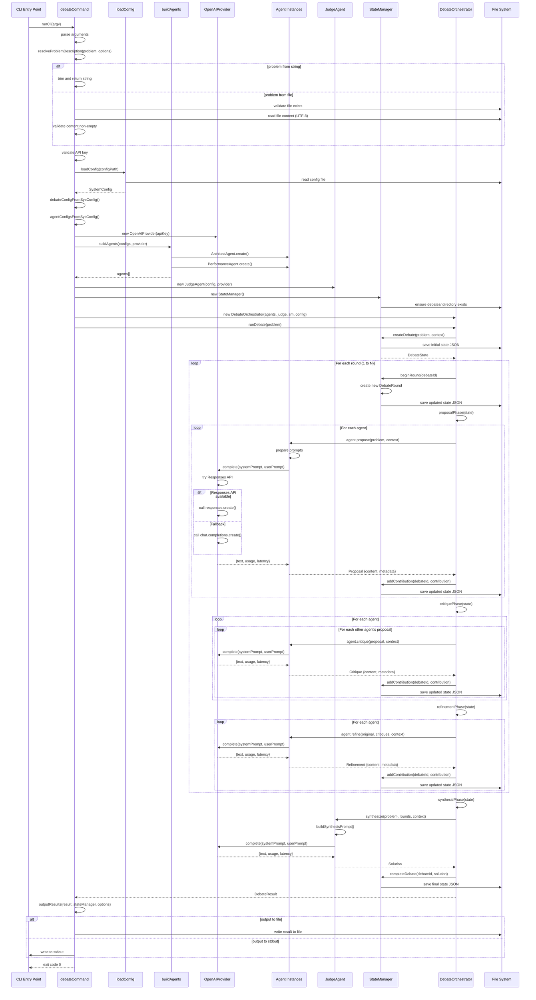

# Debate Flow Documentation

This document provides a detailed explanation of the execution flow for the debate command, from CLI invocation through to final output.

## Overview

The debate system orchestrates multi-agent discussions to solve software design problems. The flow involves configuration loading, agent initialization, multiple debate rounds (each executing proposal, critique, and refinement phases), judge synthesis, and result output. Each round is a complete cycle where agents propose solutions, critique each other's proposals, and refine their own proposals based on feedback.

## Sequence Diagram

The following diagram illustrates the complete flow of a debate execution:

## Detailed Flow Description

### 1. CLI Entry Point

**Function**: `runCli(argv: string[])`  
**Location**: `src/cli/index.ts`

The entry point for the debate system. This function:
- Creates a Commander program instance
- Sets program metadata (name, description, version)
- Registers the debate command via `debateCommand(program)`
- Parses command line arguments
- Handles top-level errors and maps them to exit codes

**Parameters**:
- `argv`: Array of command-line arguments (excluding node and script name)

**Returns**: Promise that resolves on success or rejects with an error containing an exit code

### 2. Command Registration

**Function**: `debateCommand(program: Command)`  
**Location**: `src/cli/commands/debate.ts`

Registers the debate command and its action handler with Commander. Defines:
- Command name and argument: `debate [problem]` (optional problem string)
- Options: `--problemDescription`, `--agents`, `--rounds`, `--config`, `--output`, `--verbose`
- Action handler that executes when the command is invoked

**Parameters**:
- `program`: Commander instance to register the command with

### 3. Problem Resolution

**Function**: `resolveProblemDescription(problem: string | undefined, options: any)`  
**Location**: `src/cli/commands/debate.ts`

Resolves the problem description from either command line string or file path.

**Parameters**:
- `problem`: Optional problem string from command line argument
- `options`: CLI options containing optional problemDescription file path

**Returns**: Promise resolving to resolved problem description string

**Behavior**:
- **Mutual exclusivity validation**: Ensures exactly one of problem string or problemDescription file is provided
- **String mode**: If problem string provided, trims and returns it
- **File mode**: If problemDescription option provided:
  - Resolves file path relative to current working directory
  - Validates file exists and is not a directory
  - Reads file content as UTF-8
  - Validates content is non-empty after trimming (whitespace-only = empty)
  - Returns raw content (preserving original formatting)
- **Error handling**: Throws validation errors with appropriate exit codes:
  - Both provided: EXIT_INVALID_ARGS
  - Neither provided: EXIT_INVALID_ARGS
  - File not found: EXIT_INVALID_ARGS
  - File is directory: EXIT_INVALID_ARGS
  - File empty: EXIT_INVALID_ARGS
  - Read error: EXIT_GENERAL_ERROR

### 4. Additional Validation

After problem resolution, additional validation occurs:
- **OPENAI_API_KEY**: Must be set in environment variables

If validation fails, throws an error with appropriate exit code (EXIT_CONFIG_ERROR).

### 4. Configuration Loading

**Function**: `loadConfig(configPath?: string)`  
**Location**: `src/cli/commands/debate.ts`

Loads system configuration from a JSON file or uses built-in defaults.

**Parameters**:
- `configPath`: Optional path to configuration file (default: `./debate-config.json`)

**Returns**: Promise resolving to `SystemConfig` object containing:
- `agents`: Array of agent configurations
- `judge`: Judge agent configuration
- `debate`: Debate execution settings

**Behavior**:
- If file does not exist, returns built-in defaults with warning to stderr
- If file exists but missing agents, returns built-in defaults with warning
- If file missing judge or debate config, fills in those sections from defaults with warning
- Reads and parses JSON, validates basic structure

### 5. Debate Configuration Creation

**Function**: `debateConfigFromSysConfig(sysConfig: SystemConfig, options: any)`  
**Location**: `src/cli/commands/debate.ts`

Creates debate configuration by merging system config with CLI options.

**Parameters**:
- `sysConfig`: Loaded system configuration
- `options`: CLI options from Commander

**Returns**: `DebateConfig` object containing:
- `rounds`: Number from CLI option or config or default (3)
- `terminationCondition`: From system config
- `synthesisMethod`: From system config
- `includeFullHistory`: From system config
- `timeoutPerRound`: From system config

**Validation**: Ensures rounds >= 1, throws error if invalid

### 6. Agent Configuration Filtering

**Function**: `agentConfigsFromSysConfig(sysConfig: SystemConfig, options: any)`  
**Location**: `src/cli/commands/debate.ts`

Filters agent configurations based on CLI options.

**Parameters**:
- `sysConfig`: Loaded system configuration
- `options`: CLI options from Commander

**Returns**: Array of `AgentConfig` objects

**Behavior**:
- Filters out agents where `enabled: false`
- If `--agents` option provided, filters by matching roles
- If no agents remain after filtering, falls back to default agents (architect, performance)

### 7. Provider Initialization

**Class**: `OpenAIProvider`  
**Location**: `src/providers/openai-provider.ts`

Creates an instance of the OpenAI LLM provider.

**Constructor Parameters**:
- `apiKey`: OpenAI API key from environment variable

**Method**: `complete(request: CompletionRequest)`

Makes LLM completion requests with fallback strategy:
1. **Primary**: Attempts to use OpenAI Responses API
   - Builds payload with input array format
   - Calls `client.responses.create()`
2. **Fallback**: Uses Chat Completions API
   - Builds payload with messages array format
   - Calls `client.chat.completions.create()`

**Returns**: `CompletionResponse` containing:
- `text`: Generated text from the model
- `usage`: Token usage statistics (input, output, total)

### 8. Agent Instantiation

**Function**: `buildAgents(agentConfigs: AgentConfig[], provider: OpenAIProvider)`  
**Location**: `src/cli/commands/debate.ts`

Creates concrete agent instances based on configurations.

**Parameters**:
- `agentConfigs`: Array of agent configurations
- `provider`: Initialized OpenAI provider

**Returns**: Array of Agent instances

**Behavior**:
- For role `"architect"`: Creates `ArchitectAgent.create(config, provider, resolvedSystemPrompt, promptSource)`
- For role `"performance"`: Creates `PerformanceAgent.create(config, provider, resolvedSystemPrompt, promptSource)`
- For unknown roles: Defaults to `ArchitectAgent` with warning to stderr

Prompt source resolution occurs at initialization:
- If `systemPromptPath` is set on the agent, the CLI resolves it relative to the configuration file directory and attempts to read the entire file (UTF-8)
- If the file is missing/unreadable/empty, a warning is printed to stderr and the built-in prompt is used instead
- The chosen source (built-in or absolute file path) is persisted once per debate in `DebateState.promptSources`

Each agent instance is initialized with:
- Configuration (id, name, role, model, temperature, systemPrompt)
- Provider reference for making LLM calls

### 9. Judge Instantiation

**Class**: `JudgeAgent`  
**Location**: `src/core/judge.ts`

Creates the judge agent responsible for synthesis.

Prompt source resolution for the judge:
- If `systemPromptPath` is set on the judge, it is resolved relative to the configuration file directory and read as UTF-8. Invalid/empty files cause a warning and fallback to the built-in judge prompt.
- The chosen source is also recorded in `DebateState.promptSources.judge`.

**Constructor Parameters**:
- `config`: Agent configuration (typically role: "generalist", lower temperature)
- `provider`: OpenAI provider instance

**Key Method**: `synthesize(problem: string, rounds: DebateRound[], context: DebateContext)`

Synthesizes final solution from debate history:
- Builds comprehensive prompt from problem statement and all rounds
- Calls LLM with synthesis instructions
- Returns `Solution` object with description, tradeoffs, recommendations, confidence score

### 10. State Manager Initialization

**Class**: `StateManager`  
**Location**: `src/core/state-manager.ts`

Manages debate state persistence to disk.

**Constructor Parameters**:
- `baseDir`: Directory for storing debate files (default: `./debates`)

**Behavior**:
- Ensures debates directory exists on initialization
- Maintains in-memory map of active debates
- Automatically saves state to JSON files on updates

**Key Methods**:

- `createDebate(problem: string, context?: string)`: Creates initial debate state
  - Generates unique ID with timestamp format: `deb-YYYYMMDD-HHMMSS-RAND`
  - Initializes state with status "running" and currentRound 0
  - Saves to disk immediately
  - Returns `DebateState`

- `beginRound(debateId: string)`: Begins a new round
  - Creates a new `DebateRound` object with incremented round number
  - Appends the round to state.rounds array
  - Updates state.currentRound to the new round number
  - Saves updated state to disk
  - Returns the newly created `DebateRound`

- `addContribution(debateId: string, contribution: Contribution)`: Adds contribution to current round
  - Requires that a round has been started via `beginRound()`
  - Throws error if no active round exists
  - Appends contribution to the current round's contributions array
  - Saves updated state to disk

- `completeDebate(debateId: string, solution: Solution)`: Marks debate complete
  - Sets status to "completed"
  - Attaches final solution
  - Saves final state to disk

- `failDebate(debateId: string, error: Error)`: Marks debate as failed
  - Sets status to "failed"
  - Saves updated state to disk

- `getDebate(debateId: string)`: Retrieves debate state
  - Checks in-memory cache first
  - Falls back to reading from disk
  - Revives Date objects from JSON

- `listDebates()`: Lists all debates
  - Reads all JSON files from debates directory
  - Returns array of DebateState objects sorted by creation time

### 11. Orchestrator Initialization

**Class**: `DebateOrchestrator`  
**Location**: `src/core/orchestrator.ts`

Coordinates the multi-round debate flow, executing N complete rounds where each round consists of proposal, critique, and refinement phases.

**Constructor Parameters**:
- `agents`: Array of initialized agent instances
- `judge`: Initialized judge agent
- `stateManager`: State manager instance
- `config`: Debate configuration (includes number of rounds)
- `hooks`: Optional hooks object with `onPhaseComplete` callback for notifications

**Behavior**:
- Executes `config.rounds` complete cycles of proposal → critique → refinement
- Calls `stateManager.beginRound()` at the start of each round
- All three phases execute in every round
- Optional `onPhaseComplete` hook invoked after each phase (useful for progress logging)

### 12. Debate Execution

**Method**: `orchestrator.runDebate(problem: string, context?: string)`  
**Location**: `src/core/orchestrator.ts`

Main orchestration method that executes the complete debate workflow.

**Parameters**:
- `problem`: The problem statement to debate
- `context`: Optional additional context

**Returns**: `DebateResult` containing:
- `debateId`: Unique identifier
- `solution`: Final synthesized solution
- `rounds`: All debate rounds
- `metadata`: Total rounds, duration, token counts

**Execution Flow**:

#### 12.1 State Creation
Calls `stateManager.createDebate()` to initialize debate state and persist initial JSON file.

#### 12.2 Round Loop
The orchestrator executes N complete rounds, where N is specified by `config.rounds`. Each round performs all three phases in sequence: proposal → critique → refinement.

**For each round (1 to N)**:

##### 12.2.1 Begin Round
Calls `stateManager.beginRound(debateId)` to create a new round object and increment the current round counter. The round is persisted immediately to disk.

##### 12.2.2 Proposal Phase
**Method**: `proposalPhase(state: DebateState)`

All agents generate proposals in parallel for this round.

**For each agent**:
1. Builds `DebateContext` from current state (includes full history if configured)
2. Calls `agent.propose(problem, context)`
   - Agent prepares role-specific prompts
   - Calls `proposeImpl()` which invokes `callLLM()`
   - `callLLM()` measures latency and calls `provider.complete()`
   - Returns `Proposal` with content and metadata (tokens, latency, model)
3. Builds `Contribution` object with type "proposal" and normalized metadata
4. Calls `stateManager.addContribution()` to persist contribution to current round
5. State manager saves updated JSON to disk

**Concurrency**: All agent proposals run in parallel via `Promise.all()`

##### 12.2.3 Critique Phase
**Method**: `critiquePhase(state: DebateState)`

Each agent critiques proposals from other agents within the current round.

**For each agent**:
1. Retrieves proposals from current round (just added in proposal phase)
2. Filters to get proposals from other agents only
3. **For each other agent's proposal**:
   - Calls `agent.critique(proposal, context)`
   - Agent builds critique-specific prompts
   - Calls `critiqueImpl()` which invokes `callLLM()`
   - `callLLM()` measures latency and calls `provider.complete()`
   - Returns `Critique` with content and metadata
4. Builds `Contribution` with type "critique" and target agent ID
5. Calls `stateManager.addContribution()` to persist to current round
6. State manager saves updated JSON to disk

**Concurrency**: Critiques are processed sequentially (outer loop) but could be parallelized

##### 12.2.4 Refinement Phase
**Method**: `refinementPhase(state: DebateState)`

Each agent refines their proposal based on critiques received within the current round.

**For each agent**:
1. Retrieves agent's proposal from current round
2. Retrieves all critiques targeting this agent from current round
3. Calls `agent.refine(original, critiques, context)`
   - Agent builds refinement prompts including original and all critiques
   - Calls `refineImpl()` which invokes `callLLM()`
   - `callLLM()` measures latency and calls `provider.complete()`
   - Returns refined content with updated metadata
4. Builds `Contribution` with type "refinement"
5. Calls `stateManager.addContribution()` to persist to current round
6. State manager saves updated JSON to disk

**Concurrency**: All agent refinements run in parallel via `Promise.all()`

##### 12.2.5 Phase Complete Hook
After each phase completes, if the optional `onPhaseComplete` hook is provided (typically for verbose CLI output), it is invoked with the current round number and phase type.

#### 12.3 Synthesis Phase
**Method**: `synthesisPhase(state: DebateState)`

Judge synthesizes the final solution from all debate rounds.

**Process**:
1. Builds `DebateContext` with full history
2. Calls `judge.synthesize(problem, rounds, context)`
3. Judge builds comprehensive synthesis prompt:
   - Includes problem statement
   - Includes all rounds with each contribution labeled by role and type
   - Adds synthesis instructions
4. Calls `provider.complete()` with judge's system prompt and synthesis prompt
5. Provider returns generated text
6. Judge wraps text in `Solution` object with:
   - `description`: LLM-generated solution text
   - `tradeoffs`: Empty array (future enhancement)
   - `recommendations`: Empty array (future enhancement)
   - `confidence`: Default score of 75 (future enhancement)
   - `synthesizedBy`: Judge agent ID

**Returns**: `Solution` object

#### 12.4 Debate Completion
1. Calls `stateManager.completeDebate(debateId, solution)`
2. State manager updates status to "completed"
3. Attaches final solution to state
4. Saves final complete state to JSON file
5. Returns `DebateResult` with solution, rounds, and metadata

### 13. Result Output

**Function**: `outputResults(result: DebateResult, stateManager: StateManager, options: any)`  
**Location**: `src/cli/commands/debate.ts`

Handles output of debate results based on options.

**Parameters**:
- `result`: The debate result object
- `stateManager`: State manager for retrieving full state
- `options`: CLI options containing output path and verbose flag

**Behavior**:

**If output path specified** (`--output <path>`):
- **If path ends with `.json`**:
  - Retrieves full debate state via `stateManager.getDebate()`
  - Writes complete JSON (all rounds, contributions, metadata) to file
- **Otherwise**:
  - Writes only final solution text to file

**If no output path** (default):
- Writes final solution text to stdout
- **If verbose mode** (`--verbose`):
  - Writes detailed summary to stdout:
    - Round-by-round breakdown
    - Each contribution with first line preview
    - Metadata (latency, tokens) per contribution
    - Total statistics (rounds, duration, tokens)
  - Prints which system prompt is used per agent and judge: either "built-in default" or the resolved absolute file path.

**Always**: Writes save path notice to stderr: `Saved debate to ./debates/<debate-id>.json`

### 14. Error Handling

The system uses structured error handling with exit codes:

**Exit Codes**:
- `0`: Success
- `1`: General error (EXIT_GENERAL_ERROR)
- `2`: Invalid arguments (EXIT_INVALID_ARGS)
- `3`: Provider error (EXIT_PROVIDER_ERROR, reserved)
- `4`: Configuration error (EXIT_CONFIG_ERROR)

**Error Flow**:
1. Errors thrown in action handler are caught
2. Exit code extracted from error object if present, otherwise defaults to EXIT_GENERAL_ERROR
3. Error message written to stderr
4. Error re-thrown to top-level CLI handler
5. Top-level handler extracts code and calls `process.exit(code)`

## Key Data Structures

### DebateState
Represents the complete state of a debate:
- `id`: Unique identifier
- `problem`: Problem statement
- `context`: Optional additional context
- `status`: "pending" | "running" | "completed" | "failed"
- `currentRound`: Current round number (0 when no rounds started, 1-indexed after beginRound())
- `rounds`: Array of `DebateRound` objects
- `finalSolution`: Solution object (when complete)
- `createdAt`: Creation timestamp
- `updatedAt`: Last update timestamp

### DebateRound
Represents a single round of debate:
- `roundNumber`: Round number (1-indexed)
- `contributions`: Array of `Contribution` objects (includes proposals, critiques, and refinements)
- `timestamp`: Round start time

### Contribution
Represents a single agent contribution:
- `agentId`: Agent identifier
- `agentRole`: Agent role
- `type`: "proposal" | "critique" | "refinement"
  - "proposal": Initial solution proposal
  - "critique": Critical analysis of another agent's proposal
  - "refinement": Refined version of the agent's own proposal based on received critiques
- `content`: Text content
- `targetAgentId`: Target agent (only populated for critiques)
- `metadata`: Object containing:
  - `tokensUsed`: Token count (optional)
  - `latencyMs`: Latency in milliseconds (optional)
  - `model`: Model used (optional)

### Solution
Represents the final synthesized solution:
- `description`: Solution text
- `implementation`: Implementation details (optional)
- `tradeoffs`: Array of tradeoff descriptions
- `recommendations`: Array of recommendations
- `confidence`: Confidence score (0-100)
- `synthesizedBy`: Judge agent ID

## Phase Execution Rules

The debate system executes N complete rounds, where N is specified by `config.rounds` (minimum 1).

### Round Structure
Each round consists of three phases executed in sequence:
1. **Proposal Phase**: All agents generate proposals in parallel
2. **Critique Phase**: Each agent critiques proposals from other agents
3. **Refinement Phase**: Each agent refines their proposal based on received critiques

All three phases execute in every round, regardless of the round count.

### Multiple Rounds
- **1 Round**: Single cycle of proposal → critique → refinement → synthesis
  - Agents propose fresh ideas
  - Critique each other's proposals
  - Refine based on critiques
  - Judge synthesizes final solution
  - **Use case**: Standard debate with peer review and refinement

- **2 Rounds**: Two complete cycles of proposal → critique → refinement → synthesis
  - Round 1: Initial proposals, critiques, and refinements
  - Round 2: New proposals (potentially informed by full history if enabled), new critiques, new refinements
  - Judge synthesizes from all rounds
  - **Use case**: Iterative exploration with two passes

- **3+ Rounds**: Multiple complete cycles
  - Each round: Fresh proposals → critiques → refinements
  - Full history can be included in context (via `includeFullHistory: true`)
  - Agents can build on previous rounds when history is enabled
  - Judge synthesizes from complete debate history
  - **Use case**: Deep iterative refinement and exploration of solution space

## LLM Provider Integration

### OpenAI Provider Strategy

The `OpenAIProvider` implements a two-tier fallback strategy for maximum compatibility:

**Primary Strategy**: Responses API
- Newer API with improved interface
- Uses `input` array format for messages
- Maps `max_output_tokens` for token limits
- Returns structured response with output text

**Fallback Strategy**: Chat Completions API
- Standard OpenAI API
- Uses `messages` array format
- Maps `max_tokens` for token limits
- Returns choice-based response format

**Error Handling**: If Responses API fails (not available, error, unexpected format), automatically falls back to Chat Completions API.

### Token Usage Tracking

Both APIs return usage statistics that are captured and propagated:
- Input tokens (prompt tokens)
- Output tokens (completion tokens)
- Total tokens

Usage data flows through the system:
1. Provider captures from API response
2. Agent includes in contribution metadata
3. State manager persists in contribution
4. Final result aggregates across all contributions

### Latency Measurement

Latency is measured at multiple levels:
1. **Provider level**: `callLLM()` measures wall-clock time around provider call
2. **Orchestrator level**: Captures start time before agent call, uses as fallback if provider doesn't report latency
3. **Contribution metadata**: Always includes latency, either from provider or calculated fallback

## File System Interactions

### Debate Persistence

**Directory**: `./debates/` (created automatically if missing)

**File Format**: JSON files with naming pattern: `deb-YYYYMMDD-HHMMSS-RAND.json`
- Date and time of creation embedded in filename
- Random suffix for uniqueness

**Persistence Points**:
- After initial debate creation
- After each round is begun (via `beginRound()`)
- After each contribution is added
- After debate completion with final solution

**Serialization**: Full `DebateState` object serialized as formatted JSON (2-space indent)

### Configuration Loading

**File**: `./debate-config.json` (default) or custom path via `--config`

**Format**: JSON object with SystemConfig structure

**Error Handling**: If file missing or malformed, uses built-in defaults with warning to stderr

### Output Files

**When `--output` specified**:
- JSON output: Complete `DebateState` serialized to file
- Text output: Only final solution description

**Encoding**: All files written as UTF-8

## Concurrency Model

### Parallel Operations
The following operations run concurrently:
- Proposal generation (all agents in parallel)
- Refinement generation (all agents in parallel)
- File system saves (non-blocking async writes)

### Sequential Operations
The following operations run sequentially:
- Debate rounds (round 1 → round 2 → ... → round N → synthesis)
- Phases within each round (proposal → critique → refinement)
- Critique generation (agent by agent, though could be parallelized)
- Provider API calls (one at a time per agent)

### Thread Safety
The system is single-threaded (Node.js) but uses async/await patterns:
- In-memory state map maintained by StateManager
- File writes are atomic at OS level
- No race conditions within single debate execution

## Performance Considerations

### Token Usage
- Full history mode (`includeFullHistory: true`) sends complete debate history to each agent
- This increases context size and token usage exponentially with rounds
- Trade-off: More context improves quality but costs more

### Latency
- Total latency is primarily dominated by LLM API calls
- Each round latency = proposal phase + critique phase + refinement phase:
  - Proposal phase latency = max(agent latencies) due to parallel execution
  - Critique phase latency = sum(all critique latencies) due to sequential execution
  - Refinement phase latency = max(agent latencies) due to parallel execution
- Total debate latency = sum(all round latencies) + synthesis phase latency
- Synthesis phase latency = judge synthesis latency

### File System
- Debate state saved after each contribution
- For debates with many contributions, this results in frequent writes
- Consider batching writes for high-throughput scenarios

## Extension Points

The architecture supports extension through:

1. **New Agent Roles**: Create new agent classes extending `Agent` base class
2. **New Providers**: Implement `LLMProvider` interface for other LLM services
3. **Custom Synthesis**: Extend `JudgeAgent` or create alternative synthesis methods
4. **Alternative Storage**: Replace `StateManager` for different persistence strategies
5. **Additional Phases**: Extend `DebateOrchestrator` to add new debate phases

