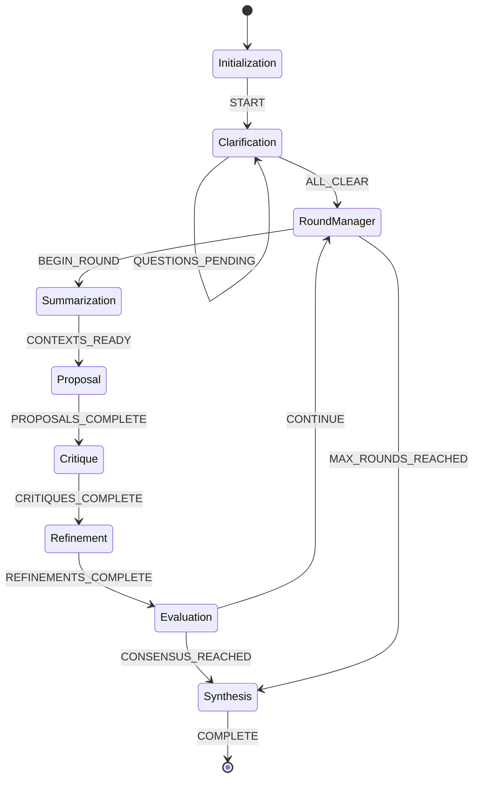
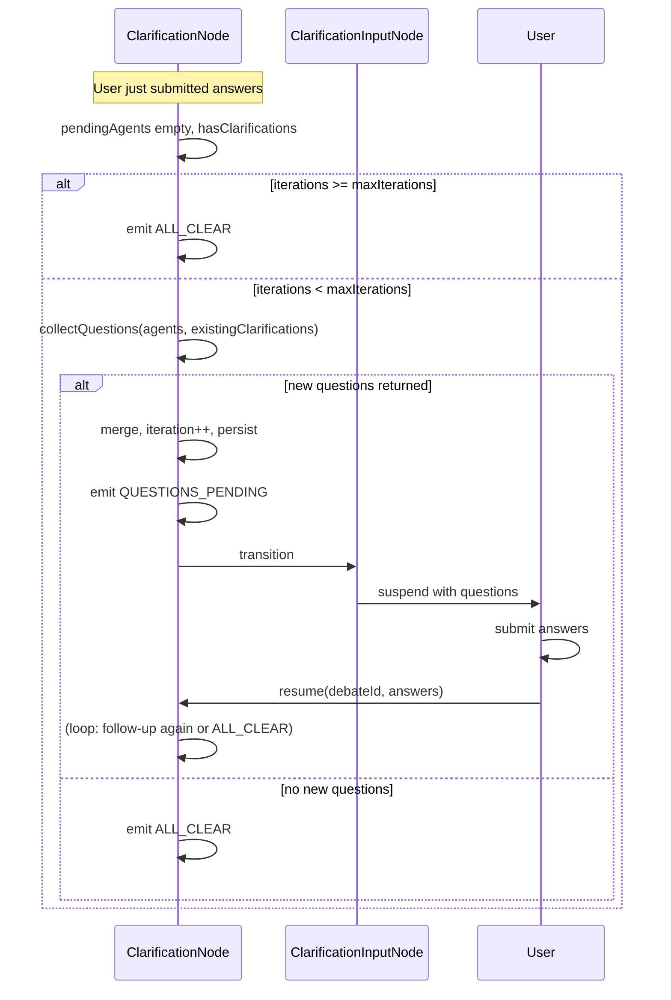

# State Machine Debate Flow

This document describes the event-driven state machine architecture for debate orchestration.

## Overview

The state machine architecture replaces the linear sequential flow with discrete nodes and event-driven transitions. This enables:

- **Dynamic termination**: Stop when consensus is reached, not after fixed rounds
- **Iterative clarifications**: Multiple Q&A rounds until agents are satisfied
- **Granular error recovery**: Retry individual nodes without restarting
- **Extensibility**: Add new nodes without changing core logic

## State Diagram



## Nodes

### Initialization Node
- **Purpose**: Creates debate state and prepares initial context
- **Emits**: `START` event
- **Transitions to**: Clarification

### Clarification Node
- **Purpose**: Collects and answers agent clarifying questions iteratively
- **Emits**: 
  - `QUESTIONS_PENDING` (more questions, loops back to self)
  - `ALL_CLEAR` (ready to proceed)
- **Transitions to**: Self (iterative) or RoundManager
- **Configuration**: 
  - `interactiveClarifications`: Enable/disable clarifications
  - `clarificationsMaxIterations`: Maximum clarification rounds (default: 3)
  - `clarificationsMaxPerAgent`: Max questions per agent per iteration

### Follow-up clarification questions

When `interactiveClarifications` is true, the clarification phase supports **follow-up questions**: after the user submits answers, agents can see those answers and optionally ask new questions. This creates additional rounds of Q&A until agents are satisfied or the iteration cap is reached.

**When it applies:** Only when `interactiveClarifications` is true. When false, the clarification node skips collection and emits `ALL_CLEAR` immediately.

**After the user submits answers:** Control returns to the Clarification node (from Clarification Input via `ANSWERS_SUBMITTED`). If all current questions are answered and `clarificationIterations < clarificationsMaxIterations`, the node runs a **follow-up round**: it calls all agents with the existing Q&A in context (`collectClarifications` receives `existingClarifications`). Agents may return new follow-up questions or an empty list.

**How the loop works:** New questions (with empty answers) are merged into state. The node emits `QUESTIONS_PENDING`, so the machine transitions to Clarification Input and suspends. The user sees the new (and possibly previous) questions; after they submit answers, `resume()` runs and control returns to the Clarification node, which can run another follow-up round or emit `ALL_CLEAR`.

**Cap:** When `clarificationIterations >= clarificationsMaxIterations`, the node does not run another collection and emits `ALL_CLEAR`.

**CLI and web-api:** The same mechanism is used in both. The orchestrator only suspends with a questions payload and resumes with answers; how questions are presented (readline in CLI, WebSocket in web-api) and how answers are collected is outside core.



### Round Manager Node
- **Purpose**: Coordinates round execution and determines when to start new rounds
- **Emits**: 
  - `BEGIN_ROUND` (start new round)
  - `MAX_ROUNDS_REACHED` (proceed to synthesis)
- **Transitions to**: Summarization or Synthesis
- **Logic**: Checks if current round < max rounds; if yes, starts new round; if no, proceeds to synthesis

### Summarization Node
- **Purpose**: Prepares contexts for all agents, potentially summarizing history
- **Emits**: `CONTEXTS_READY` event
- **Transitions to**: Proposal
- **Behavior**: Each agent independently evaluates if summarization is needed and generates summaries if necessary

### Proposal Node
- **Purpose**: Generates proposals from all agents
- **Emits**: `PROPOSALS_COMPLETE` event
- **Transitions to**: Critique
- **Behavior**: 
  - Round 1: Fresh proposals from LLM
  - Round 2+: Carries over previous round's refinements as proposals

### Critique Node
- **Purpose**: Each agent critiques other agents' proposals
- **Emits**: `CRITIQUES_COMPLETE` event
- **Transitions to**: Refinement
- **Behavior**: Each agent critiques all other agents' proposals concurrently

### Refinement Node
- **Purpose**: Each agent refines their proposal based on critiques
- **Emits**: `REFINEMENTS_COMPLETE` event
- **Transitions to**: Evaluation
- **Behavior**: Each agent refines their own proposal using critiques from others

### Evaluation Node
- **Purpose**: Evaluates consensus and determines if debate should continue
- **Emits**: 
  - `CONTINUE` (proceed to next round)
  - `CONSENSUS_REACHED` (proceed to synthesis)
  - `MAX_ROUNDS_REACHED` (safety guardrail)
- **Transitions to**: RoundManager or Synthesis
- **Logic**:
  - For `"fixed"` termination: Always continue until max rounds
  - For `"convergence"` or `"quality"`: Evaluates confidence using judge's `evaluateConfidence()` method
  - If confidence >= threshold: Emit `CONSENSUS_REACHED`
  - Otherwise: Emit `CONTINUE`

### Synthesis Node
- **Purpose**: Generates final solution from all debate rounds
- **Emits**: `COMPLETE` event (terminal)
- **Transitions to**: Terminal (null)
- **Behavior**: Judge synthesizes solution from all rounds, potentially summarizing history first

## Events

| Event | Description | Typical Source |
|-------|-------------|----------------|
| `START` | Begin debate execution | Initialization |
| `QUESTIONS_PENDING` | More clarification questions needed | Clarification |
| `ALL_CLEAR` | Clarifications complete | Clarification |
| `BEGIN_ROUND` | Start a new round | RoundManager |
| `CONTEXTS_READY` | Agent contexts prepared | Summarization |
| `PROPOSALS_COMPLETE` | All proposals generated | Proposal |
| `CRITIQUES_COMPLETE` | All critiques generated | Critique |
| `REFINEMENTS_COMPLETE` | All refinements generated | Refinement |
| `CONTINUE` | Continue to next round | Evaluation |
| `CONSENSUS_REACHED` | Consensus reached, proceed to synthesis | Evaluation |
| `MAX_ROUNDS_REACHED` | Maximum rounds reached | RoundManager or Evaluation |
| `COMPLETE` | Debate complete | Synthesis |
| `FAILED` | Debate failed (error handling) | Any node |
| `RETRY` | Retry current node (error recovery) | Any node |
| `FALLBACK` | Fallback behavior (error recovery) | Any node |

## Configuration

The state machine respects these configuration options:

- `terminationCondition.type`: Controls when debate ends
  - `"fixed"`: Run exactly N rounds
  - `"convergence"`: Stop when confidence threshold met
  - `"quality"`: Stop when quality threshold met
- `terminationCondition.threshold`: Confidence/quality threshold (default: 80)
- `rounds`: Maximum rounds (hard limit for all termination types)
- `clarificationsMaxIterations`: Max clarification rounds (default: 3)
- `interactiveClarifications`: Enable/disable clarifications phase

## Comparison with Linear Flow

| Aspect | Linear Flow | State Machine |
|--------|-------------|---------------|
| Rounds | Fixed count | Dynamic (max limit) |
| Termination | After N rounds | On consensus or max |
| Clarifications | Single pass | Iterative |
| Error handling | Fail entire debate | Retry node |
| Extensibility | Modify orchestrator | Add new nodes/transitions |

## Implementation Details

### Node Interface

All nodes implement the `DebateNode` interface:

```typescript
interface DebateNode {
  readonly nodeType: NodeType;
  execute(context: NodeContext): Promise<NodeResult>;
}
```

### Node Context

Nodes receive a `NodeContext` containing:
- `state`: Current debate state
- `config`: Debate configuration
- `agents`: Array of participating agents
- `judge`: Judge agent instance
- `stateManager`: State persistence manager
- `preparedContexts`: Map of agent ID to prepared context (optional)
- `tracingContext`: Tracing context (optional)
- `contextDirectory`: Context directory path (optional)

### Node Result

Nodes return a `NodeResult` containing:
- `event`: The event to emit (drives transitions)
- `updatedContext`: Optional partial context updates

### Transition Graph

Transitions are defined declaratively in `TransitionGraph`:

```typescript
type TransitionRule = {
  from: NodeType;
  event: keyof typeof DEBATE_EVENTS;
  to: NodeType | null;
  condition?: (context: NodeContext) => boolean;
};
```

### State Machine Orchestrator

The `StateMachineOrchestrator` maintains:
- Current node state
- Transition graph
- Map of node instances
- Executes nodes in a loop until terminal state

## Usage

The state machine orchestrator maintains the same API as the original `DebateOrchestrator`:

```typescript
const orchestrator = new StateMachineOrchestrator(
  agents,
  judge,
  stateManager,
  config,
  hooks,
  tracingContext,
  contextDirectory
);

const result = await orchestrator.runDebate(problem, context, clarifications, debateId);
```

This allows drop-in replacement of the original orchestrator while gaining the benefits of the state machine architecture.
