# Evaluation Flow Documentation

This document provides a detailed explanation of the execution flow for the eval command, from CLI invocation through to final output.

## Overview

The evaluation system uses multiple evaluator agents to assess completed debates. The flow involves loading evaluator configuration, instantiating evaluator agents, loading and validating debate state, running all evaluators in parallel, parsing and aggregating their results, and outputting the aggregated evaluation in JSON or Markdown format.

## Sequence Diagram

The following diagram illustrates the complete flow of an evaluation execution:

```mermaid
sequenceDiagram
    participant CLI as CLI Entry Point
    participant Cmd as evalCommand
    participant Env as loadEnvironmentFile
    participant Config as loadEvaluatorConfig
    participant Builder as buildEvaluatorAgents
    participant Prompt as resolvePrompt
    participant Provider as ProviderFactory
    participant EA as EvaluatorAgent
    participant Debate as loadAndValidateDebateState
    participant FS as File System
    participant Parser as parseFirstJsonObject
    participant Agg as Aggregate Scores
    participant Output as writeEvaluationResults

    CLI->>Cmd: runCli(argv)
    Cmd->>Cmd: parse arguments
    Cmd->>Env: loadEnvironmentFile(envFilePath, verbose)
    Env->>FS: read .env file (if exists)
    Env-->>Cmd: environment variables loaded
    
    Cmd->>Config: loadAndValidateEnabledAgents(configPath)
    Config->>FS: read evaluator config JSON
    Config->>Config: validate agents array exists and non-empty
    Config->>Config: filter enabled agents (enabled !== false)
    Config->>Config: validate at least one enabled agent
    Config-->>Cmd: { enabledAgents, configDir }
    
    Cmd->>Builder: buildEvaluatorAgents(enabledAgents, configDir, verbose)
    loop For each enabled agent
        Builder->>Prompt: resolvePrompt(systemPromptPath, configDir)
        alt systemPromptPath provided
            Prompt->>FS: read system prompt file (UTF-8)
            Prompt-->>Builder: { text, source: 'file', absPath }
        else no systemPromptPath
            Prompt->>Prompt: readBuiltInPrompt('eval/prompts/system.md')
            Prompt-->>Builder: { text, source: 'built-in' }
        end
        
        Builder->>Prompt: resolvePrompt(userPromptPath, configDir)
        alt userPromptPath provided
            Prompt->>FS: read user prompt file (UTF-8)
            Prompt-->>Builder: { text, source: 'file', absPath }
        else no userPromptPath
            Prompt->>Prompt: readBuiltInPrompt('eval/prompts/user.md')
            Prompt-->>Builder: { text, source: 'built-in' }
        end
        
        Builder->>Provider: createProvider(agent.provider)
        Provider-->>Builder: LLMProvider instance
        
        Builder->>EA: EvaluatorAgent.fromConfig(config, systemPrompt, userPrompt)
        EA->>EA: new EvaluatorAgent(config, provider, systemPrompt, userPrompt)
        EA-->>Builder: EvaluatorAgent instance
    end
    Builder-->>Cmd: evaluators[]
    
    Cmd->>Debate: loadAndValidateDebateState(debatePath)
    Debate->>FS: read debate JSON file
    Debate->>Debate: parse DebateState JSON
    Debate->>Debate: validate problem field exists and non-empty
    Debate->>Debate: validate finalSolution.description exists and non-empty
    Debate->>Debate: buildClarificationsMarkdown(state)
    Debate-->>Cmd: { problem, finalSolution, clarificationsMarkdown }
    
    Cmd->>Cmd: build inputs object { problem, clarificationsMarkdown, finalSolution }
    
    Cmd->>Cmd: Promise.allSettled(evaluators.map(e => e.evaluate(inputs)))
    par Parallel evaluation for all agents
        Cmd->>EA: evaluator.evaluate(inputs)
        EA->>EA: renderUserPrompt(inputs)
        EA->>EA: replace placeholders {problem}, {clarifications}, {final_solution}
        EA->>EA: provider.complete({ model, temperature: 0.1, systemPrompt, userPrompt })
        EA->>Provider: complete(request)
        Provider->>Provider: try Responses API
        alt Responses API available
            Provider->>Provider: call responses.create()
        else Fallback
            Provider->>Provider: call chat.completions.create()
        end
        Provider-->>EA: { text, usage, latency }
        EA->>EA: measure latency
        EA-->>Cmd: { id, rawText, latencyMs, usage }
    end
    Cmd-->>Cmd: PromiseSettledResult[] results
    
    Cmd->>Cmd: process results and aggregate scores
    loop For each result
        Cmd->>Parser: validateAndParseEvaluatorResult(result, agentId)
        alt result.status === 'fulfilled'
            Parser->>Parser: parseFirstJsonObject(rawText)
            Parser->>Parser: extract JSON object from text
            Parser-->>Cmd: ParsedEvaluation | null
        else result.status === 'rejected'
            Parser-->>Cmd: null (writes warning to stderr)
        end
        
        alt ParsedEvaluation valid
            Cmd->>Agg: pushIfValid(arrFc, func.score, ...)
            Cmd->>Agg: pushIfValid(arrPerf, nonf.performance_scalability.score, ...)
            Cmd->>Agg: pushIfValid(arrSec, nonf.security.score, ...)
            Cmd->>Agg: pushIfValid(arrMaint, nonf.maintainability_evolvability.score, ...)
            Cmd->>Agg: pushIfValid(arrReg, nonf.regulatory_compliance.score, ...)
            Cmd->>Agg: pushIfValid(arrTest, nonf.testability.score, ...)
            Cmd->>Agg: pushIfValid(arrOverall, overall_summary.overall_score, ...)
        end
    end
    
    Cmd->>Agg: calculate averages (averageOrNull) for each metric
    Agg-->>Cmd: AggregatedAverages
    
    Cmd->>Output: writeEvaluationResults(aggregatedAverages, perAgentResults, outputPath, debatePath)
    alt outputPath ends with .json
        Output->>Output: buildAggregatedJsonOutput(aggregatedAverages, perAgentResults)
        Output->>FS: write JSON file (UTF-8, 2-space indent)
    else outputPath ends with .csv
        Output->>Output: writeCsvOutput(resolvedPath, debatePath, aggregatedAverages)
        Output->>Output: extract debate filename, format CSV row
        alt CSV file exists
            Output->>FS: appendFile(data row + newline)
        else CSV file doesn't exist
            Output->>FS: writeFile(header + newline + data row + newline)
        end
    else outputPath exists but not .json/.csv
        Output->>Output: writeMarkdownOutput(resolvedPath, aggregatedAverages)
        Output->>Output: renderMarkdownTable(aggregatedAverages)
        Output->>FS: write Markdown file (UTF-8)
    else no outputPath
        Output->>Output: writeMarkdownOutput(undefined, aggregatedAverages)
        Output->>Output: renderMarkdownTable(aggregatedAverages)
        Output->>CLI: write to stdout
    end
    
    Cmd-->>CLI: exit code 0
```



## Detailed Flow Description

### 1. CLI Entry Point

**Function**: `runCli(argv: string[])`  
**Location**: `packages/cli/src/index.ts`

The entry point for the evaluation system. This function:
- Creates a Commander program instance
- Sets program metadata (name, description, version)
- Registers the eval command via `evalCommand(program)`
- Parses command line arguments
- Handles top-level errors and maps them to exit codes

**Parameters**:
- `argv`: Array of command-line arguments (excluding node and script name)

**Returns**: Promise that resolves on success or rejects with an error containing an exit code

### 2. Command Registration

**Function**: `evalCommand(program: Command)`  
**Location**: `packages/cli/src/commands/eval.ts`

Registers the eval command and its action handler with Commander. Defines:
- Command name: `eval`
- Options: `-c, --config <path>`, `-d, --debate <path>`, `--env-file <path>`, `-v, --verbose`, `-o, --output <path>`
- Action handler that executes when the command is invoked

**Parameters**:
- `program`: Commander instance to register the command with

### 3. Environment File Loading

**Function**: `loadEnvironmentFile(envFilePath?: string, verbose?: boolean)`  
**Location**: `packages/core/src/utils/env-loader.ts`

Loads environment variables from a .env file using the dotenv library.

**Parameters**:
- `envFilePath`: Optional path to .env file (default: `.env` in current working directory)
- `verbose`: Whether to output verbose logging

**Behavior**:
- If default `.env` file doesn't exist: continues silently (non-breaking), optionally warns in verbose mode
- If custom env file path specified and doesn't exist: throws error
- Uses dotenv to parse and load environment variables
- Loads API keys required for LLM providers (OPENAI_API_KEY, OPENROUTER_API_KEY)

### 4. Evaluator Configuration Loading

**Function**: `loadAndValidateEnabledAgents(configPath: string)`  
**Location**: `packages/cli/src/commands/eval.ts`

Loads evaluator configuration file, validates structure, and filters for enabled agents.

**Parameters**:
- `configPath`: Path to evaluator configuration JSON file

**Returns**: Object containing:
- `enabledAgents`: Array of enabled evaluator configurations
- `configDir`: Absolute directory path containing the configuration file

**Execution Flow**:

#### 4.1 Load Configuration File
1. Calls `loadEvaluatorConfig(configPath)`:
   - Resolves path relative to current working directory
   - Calls `readJsonFile()` to read and parse JSON
   - Validates file exists and is a regular file
   - Validates JSON is parseable
   - Validates `agents` array exists and has at least one entry
   - Maps raw agent objects to `EvaluatorConfig` format
   - Returns `{ agents, configDir }`

#### 4.2 Filter Enabled Agents
1. Filters agents using `isEnabledEvaluator()`:
   - Agent is enabled if `enabled !== false` (defaults to true if undefined)
   - Removes agents where `enabled: false`

#### 4.3 Validate Enabled Agents Exist
1. Validates at least one enabled agent remains:
   - If no enabled agents found, throws validation error with EXIT_INVALID_ARGS

**Configuration Schema**:
```json
{
  "agents": [
    {
      "id": "eval-1",
      "name": "Evaluator 1",
      "model": "gpt-4",
      "provider": "openai",
      "systemPromptPath": "./prompts/system.md",
      "userPromptPath": "./prompts/user.md",
      "timeout": 30000,
      "enabled": true
    }
  ]
}
```

### 5. Evaluator Agent Instantiation

**Function**: `buildEvaluatorAgents(enabledAgents: EvaluatorConfig[], configDir: string, verbose: boolean)`  
**Location**: `packages/cli/src/commands/eval.ts`

Creates EvaluatorAgent instances from enabled evaluator configurations.

**Parameters**:
- `enabledAgents`: Array of enabled evaluator configurations
- `configDir`: Absolute directory path for resolving relative prompt paths
- `verbose`: Whether to log detailed information about each agent

**Returns**: Array of `EvaluatorAgent` instances

**Execution Flow**:

#### 5.1 Load Default Prompts
1. Loads built-in system prompt:
   - Calls `readBuiltInPrompt('eval/prompts/system.md', fallbackText)`
   - Attempts to read from `dist/eval/prompts/system.md` (runtime)
   - Falls back to `packages/core/src/eval/prompts/system.md` (tests)
   - Uses fallback text if file unavailable

2. Loads built-in user prompt:
   - Calls `readBuiltInPrompt('eval/prompts/user.md', fallbackText)`
   - Same resolution strategy as system prompt

#### 5.2 For Each Enabled Agent
1. **Resolve System Prompt**:
   - Calls `resolvePrompt()` with agent's `systemPromptPath`:
     - If `systemPromptPath` provided: resolves relative to `configDir`, reads file (UTF-8)
     - If file missing/unreadable/empty: warns and uses built-in default
     - Returns `{ text, source, absPath? }`

2. **Resolve User Prompt**:
   - Calls `resolvePrompt()` with agent's `userPromptPath`:
     - Same resolution strategy as system prompt
     - Returns `{ text, source, absPath? }`

3. **Create Provider**:
   - Calls `createProvider(agent.provider)`:
     - Creates `OpenAIProvider` for "openai"
     - Creates `OpenRouterProvider` for "openrouter"
     - Returns `LLMProvider` instance

4. **Instantiate EvaluatorAgent**:
   - Calls `EvaluatorAgent.fromConfig(config, systemPrompt, userPrompt)`:
     - Creates provider instance
     - Constructs `EvaluatorAgent` with:
       - Configuration (id, name, model)
       - Provider instance
       - Resolved system prompt
       - Resolved user prompt template

5. **Verbose Logging** (if enabled):
   - Logs to stderr: agent ID, provider, model, system prompt source, user prompt source

### 6. Debate State Loading and Validation

**Function**: `loadAndValidateDebateState(debatePath: string)`  
**Location**: `packages/cli/src/commands/eval.ts`

Loads and validates a debate state file, extracting required fields for evaluation.

**Parameters**:
- `debatePath`: Path to debate state JSON file

**Returns**: Object containing:
- `problem`: Problem statement string
- `finalSolution`: Final solution description string
- `clarificationsMarkdown`: Markdown-formatted clarifications string

**Execution Flow**:

#### 6.1 Load Debate File
1. Calls `readJsonFile<DebateState>(debatePath)`:
   - Resolves path relative to current working directory
   - Validates file exists and is a regular file
   - Reads file content as UTF-8
   - Parses JSON to `DebateState` object

#### 6.2 Validate Required Fields
1. **Problem Validation**:
   - Extracts `debate.problem` and trims whitespace
   - If empty or missing, throws validation error with EXIT_INVALID_ARGS

2. **Final Solution Validation**:
   - Extracts `debate.finalSolution.description` and trims whitespace
   - If empty or missing, throws validation error with EXIT_INVALID_ARGS

#### 6.3 Build Clarifications Markdown
1. Calls `buildClarificationsMarkdown(debate)`:
   - If no clarifications: returns minimal code block separator
   - Otherwise: builds Markdown-formatted string:
     - For each agent's clarification group:
       - Adds H3 header: `### {agentName} ({role})`
       - For each question-answer pair:
         - Adds question: `Question (q1):\n\n```text\n{question}\n```\n\n`
         - Adds answer: `Answer:\n\n```text\n{answer}\n```\n\n`
   - Returns trimmed Markdown string

### 7. Evaluation Execution

**Method**: `evaluator.evaluate(inputs: EvaluatorInputs)`  
**Location**: `packages/core/src/eval/evaluator-agent.ts`

Performs the evaluation using the underlying LLM provider.

**Parameters**:
- `inputs`: Object containing:
  - `problem`: Problem statement string
  - `clarificationsMarkdown`: Markdown-formatted clarifications
  - `finalSolution`: Final solution description string

**Returns**: `EvaluatorResult` containing:
- `id`: Agent identifier
- `rawText`: Raw LLM response text
- `latencyMs`: Latency in milliseconds
- `usage`: Optional token usage statistics

**Execution Flow**:

#### 7.1 Render User Prompt
1. Calls `renderUserPrompt(inputs)`:
   - Replaces `{problem}` placeholder with `inputs.problem`
   - Replaces `{clarifications}` placeholder with `inputs.clarificationsMarkdown`
   - Replaces `{final_solution}` placeholder with `inputs.finalSolution`
   - Returns rendered user prompt string

#### 7.2 Invoke LLM Provider
1. Records start time for latency measurement
2. Calls `provider.complete()` with:
   - `model`: Agent's configured model
   - `temperature`: Fixed at 0.1 (for deterministic evaluation)
   - `systemPrompt`: Resolved system prompt
   - `userPrompt`: Rendered user prompt

3. Provider execution:
   - **Primary**: Attempts Responses API (`client.responses.create()`)
   - **Fallback**: Uses Chat Completions API (`client.chat.completions.create()`)
   - Returns `CompletionResponse` with text and usage statistics

#### 7.3 Measure Latency and Build Result
1. Calculates latency: `Date.now() - started`
2. Builds `EvaluatorResult`:
   - `id`: Agent identifier
   - `rawText`: Response text from provider
   - `latencyMs`: Calculated latency
   - `usage`: Token usage (if available)

#### 7.4 Error Handling
- If provider call fails: logs error to stderr with agent ID and rethrows
- Error propagates to Promise.allSettled for graceful handling

### 8. Parallel Evaluation Execution

**Location**: `packages/cli/src/commands/eval.ts` (action handler)

Runs all evaluator agents in parallel and collects results.

**Execution Flow**:

#### 8.1 Build Inputs Object
1. Creates `inputs` object:
   ```typescript
   {
     problem,
     clarificationsMarkdown,
     finalSolution
   }
   ```

#### 8.2 Execute All Evaluators
1. Calls `Promise.allSettled(evaluators.map(e => e.evaluate(inputs)))`:
   - Maps each evaluator to its `evaluate()` promise
   - Uses `allSettled` to handle failures gracefully (doesn't fail fast)
   - All evaluations run concurrently in parallel
   - Returns array of `PromiseSettledResult` objects

#### 8.3 Process Results
1. Iterates through `PromiseSettledResult[]`:
   - For each result:
     - Calls `validateAndParseEvaluatorResult(result, agentId)`
     - If result is rejected: logs warning, returns null
     - If result is fulfilled: parses JSON from raw text, returns `ParsedEvaluation | null`

### 9. Result Parsing and Validation

**Function**: `validateAndParseEvaluatorResult(result: PromiseSettledResult<any>, agentId: string)`  
**Location**: `packages/cli/src/commands/eval.ts`

Validates and parses an evaluator agent's result from a Promise.allSettled outcome.

**Parameters**:
- `result`: The settled promise result from an evaluator agent
- `agentId`: Agent identifier for warning messages

**Returns**: `ParsedEvaluation | null`

**Execution Flow**:

#### 9.1 Check Promise Status
1. If `result.status !== 'fulfilled'`:
   - Writes warning to stderr: `[agentId] Skipped due to error`
   - Returns null

#### 9.2 Extract Raw Text
1. Extracts `result.value.rawText` (empty string if missing)

#### 9.3 Parse JSON
1. Calls `parseFirstJsonObject(rawText)`:
   - Searches for first JSON object in text (between first `{` and matching `}`)
   - If no match found, attempts to parse entire string
   - If parsing fails, returns null

2. If parsing returns null:
   - Writes warning to stderr: `[agentId] Invalid JSON output; skipping agent`
   - Returns null

3. Returns parsed object as `ParsedEvaluation`

### 10. Score Aggregation

**Location**: `packages/cli/src/commands/eval.ts` (action handler)

Aggregates scores from all evaluators and calculates averages.

**Execution Flow**:

#### 10.1 Initialize Score Arrays
1. Creates arrays for each metric:
   - `arrFc`: Functional completeness scores
   - `arrPerf`: Performance & scalability scores
   - `arrSec`: Security scores
   - `arrMaint`: Maintainability & evolvability scores
   - `arrReg`: Regulatory compliance scores
   - `arrTest`: Testability scores
   - `arrOverall`: Overall scores

#### 10.2 Extract and Validate Scores
For each parsed evaluation result:

1. **Extract Scores**:
   - `functional_completeness.score` from `parsed.evaluation.functional_completeness`
   - `performance_scalability.score` from `parsed.evaluation.non_functional.performance_scalability`
   - `security.score` from `parsed.evaluation.non_functional.security`
   - `maintainability_evolvability.score` from `parsed.evaluation.non_functional.maintainability_evolvability`
   - `regulatory_compliance.score` from `parsed.evaluation.non_functional.regulatory_compliance`
   - `testability.score` from `parsed.evaluation.non_functional.testability`
   - `overall_score` from `parsed.overall_summary.overall_score`

2. **Validate and Push Scores**:
   - Calls `pushIfValid(array, value, label, agentId)` for each score:
     - Validates value is a finite number using `numOrUndefined()`
     - If invalid: writes warning to stderr, skips
     - Clamps value to range [1, 10] using `clampScoreToRange()`
     - If clamped: writes warning to stderr with original value
     - Appends clamped value to array

#### 10.3 Calculate Averages
1. Calculates average for each metric using `averageOrNull()`:
   - If array is empty: returns `null` (N/A)
   - Otherwise: calculates average and returns as number
   - Creates `AggregatedAverages` object:
     ```typescript
     {
       functional_completeness: number | null,
       performance_scalability: number | null,
       security: number | null,
       maintainability_evolvability: number | null,
       regulatory_compliance: number | null,
       testability: number | null,
       overall_score: number | null
     }
     ```

### 11. Result Output

**Function**: `writeEvaluationResults(aggregatedAverages, perAgentResults, outputPath, debatePath)`  
**Location**: `packages/cli/src/commands/eval.ts`

Writes evaluation results to a file or stdout in JSON, CSV, or Markdown format.

**Parameters**:
- `aggregatedAverages`: Aggregated average scores for all metrics
- `perAgentResults`: Per-agent parsed evaluation results, keyed by agent ID
- `outputPath`: Optional output file path
- `debatePath`: Path to the debate file (used to extract filename for CSV)

**Execution Flow**:

#### 11.1 Resolve Output Path
1. If `outputPath` provided: resolves relative to current working directory
2. Otherwise: `undefined` (write to stdout)

#### 11.2 JSON Output Format
If resolved path ends with `.json`:

1. Calls `buildAggregatedJsonOutput(aggregatedAverages, perAgentResults)`:
   - Builds `AggregatedJsonOutput` object:
     ```typescript
     {
       evaluation: {
         functional_completeness: { average_score: number | null },
         non_functional: {
           performance_scalability: { average_score: number | null },
           security: { average_score: number | null },
           maintainability_evolvability: { average_score: number | null },
           regulatory_compliance: { average_score: number | null },
           testability: { average_score: number | null }
         }
       },
       overall_score: number | null,
       agents: Record<string, ParsedEvaluation>
     }
     ```

2. Writes JSON file:
   - Formats with 2-space indent
   - Encodes as UTF-8
   - Writes to resolved path

#### 11.3 CSV Output Format
If resolved path ends with `.csv`:

1. Calls `writeCsvOutput(resolvedPath, debatePath, aggregatedAverages)`:
   - Extracts debate filename using `path.basename(debatePath)`
   - Removes `.json` extension if present
   - Formats CSV row using `formatCsvRow(debateFilename, aggregatedAverages)`:
     - Formats each score: null → empty string, number → `toFixed(2)`
     - Escapes CSV fields using `escapeCsvField()` (RFC 4180):
       - Values with commas, quotes, or newlines are quoted
       - Internal quotes are escaped by doubling (`"` → `""`)
     - Joins fields with commas

2. Checks if CSV file exists:
   - **If file exists**: Appends data row + newline using `fs.promises.appendFile()`
   - **If file doesn't exist**: Writes header row + newline + data row + newline using `fs.promises.writeFile()`

3. CSV header format:
   ```
   debate,Functional Completeness,Performance & Scalability,Security,Maintainability & Evolvability,Regulatory Compliance,Testability,Overall Score
   ```

4. CSV data row format:
   - First column: Debate filename (without `.json` extension)
   - Remaining 7 columns: Formatted scores (2 decimal places) or empty string for null values

#### 11.4 Markdown Output Format
Otherwise (path doesn't end with `.json` or `.csv`, or no path):

1. Calls `writeMarkdownOutput(resolvedPath, aggregatedAverages)`:
   - Calls `renderMarkdownTable(aggregatedAverages)`:
     - Formats each score to 2 decimal places (or "N/A" if null)
     - Builds Markdown table:
       ```markdown
       | Functional Completeness | Performance & Scalability | Security | Maintainability & Evolvability | Regulatory Compliance | Testability | Overall Score |
       |------------------------|---------------------------|----------|-------------------------------|------------------------|------------|---------------|
       | 8.50 | 7.25 | 9.00 | 8.00 | N/A | 7.75 | 8.10 |
       ```

2. Writes output:
   - If `resolvedPath` provided: writes Markdown file (UTF-8)
   - Otherwise: writes to stdout

### 12. Error Handling

The system uses structured error handling with exit codes:

**Exit Codes**:
- `0`: Success
- `1`: General error (EXIT_GENERAL_ERROR)
- `2`: Invalid arguments (EXIT_INVALID_ARGS)
- `4`: Configuration error (EXIT_CONFIG_ERROR)

**Error Flow**:
1. Errors thrown in action handler are caught
2. Exit code extracted from error object if present, otherwise defaults to EXIT_GENERAL_ERROR
3. Error message written to stderr
4. Error re-thrown to top-level CLI handler
5. Top-level handler extracts code and calls `process.exit(code)`

**Validation Errors**:
- Missing or invalid config file: EXIT_INVALID_ARGS
- No enabled evaluator agents: EXIT_INVALID_ARGS
- Missing or invalid debate file: EXIT_INVALID_ARGS
- Missing problem or final solution: EXIT_INVALID_ARGS
- Missing API keys: EXIT_CONFIG_ERROR (handled by provider factory)

**Evaluation Errors**:
- Individual evaluator failures: logged to stderr, agent skipped, evaluation continues
- Invalid JSON output: logged to stderr, agent skipped, evaluation continues
- Missing scores: logged to stderr, score skipped, aggregation continues

## Key Data Structures

### EvaluatorConfig
Represents an evaluator agent configuration:
- `id`: Unique identifier (string)
- `name`: Human-readable name (string)
- `model`: LLM model name (string)
- `provider`: Provider type ("openai" or "openrouter")
- `systemPromptPath`: Optional path to system prompt file
- `userPromptPath`: Optional path to user prompt file
- `timeout`: Optional timeout in milliseconds (currently ignored)
- `enabled`: Optional boolean (defaults to true if undefined)

### EvaluatorInputs
Inputs passed to each evaluator agent:
- `problem`: Problem statement string
- `clarificationsMarkdown`: Markdown-formatted clarifications string
- `finalSolution`: Final solution description string

### EvaluatorResult
Result from a single evaluator agent:
- `id`: Agent identifier
- `rawText`: Raw LLM response text
- `latencyMs`: Latency in milliseconds
- `usage`: Optional token usage statistics (inputTokens, outputTokens, totalTokens)

### ParsedEvaluation
Parsed evaluation output from an evaluator agent:
- `evaluation`: Optional evaluation object containing:
  - `functional_completeness`: Optional object with `score` (number) and `reasoning` (string)
  - `non_functional`: Optional object containing:
    - `performance_scalability`: Optional object with `score` and `reasoning`
    - `security`: Optional object with `score` and `reasoning`
    - `maintainability_evolvability`: Optional object with `score` and `reasoning`
    - `regulatory_compliance`: Optional object with `score` and `reasoning`
    - `testability`: Optional object with `score` and `reasoning`
- `overall_summary`: Optional object with:
  - `strengths`: Optional string
  - `weaknesses`: Optional string
  - `overall_score`: Optional number

### AggregatedAverages
Aggregated average scores across all evaluators:
- `functional_completeness`: number | null
- `performance_scalability`: number | null
- `security`: number | null
- `maintainability_evolvability`: number | null
- `regulatory_compliance`: number | null
- `testability`: number | null
- `overall_score`: number | null

### AggregatedJsonOutput
Complete JSON output format:
- `evaluation`: Object with functional and non-functional metrics
- `overall_score`: Overall average score
- `agents`: Record mapping agent IDs to their `ParsedEvaluation` objects

## File System Interactions

### Configuration File Loading

**File Format**: JSON file with evaluator agent configurations

**Location**: Specified via `--config <path>` option

**Validation**:
- File must exist and be a regular file
- Must contain valid JSON
- Must have `agents` array with at least one entry
- At least one agent must be enabled (`enabled !== false`)

**Error Handling**:
- Missing file: EXIT_INVALID_ARGS
- Invalid JSON: EXIT_INVALID_ARGS
- Missing or empty agents array: EXIT_INVALID_ARGS
- No enabled agents: EXIT_INVALID_ARGS

### Debate State File Loading

**File Format**: JSON file with `DebateState` structure

**Location**: Specified via `--debate <path>` option

**Required Fields**:
- `problem`: Non-empty string
- `finalSolution.description`: Non-empty string

**Optional Fields**:
- `clarifications`: Array of `AgentClarifications` objects

**Validation**:
- File must exist and be a regular file
- Must contain valid JSON
- Problem field must exist and be non-empty after trimming
- Final solution description must exist and be non-empty after trimming

**Error Handling**:
- Missing file: EXIT_INVALID_ARGS
- Invalid JSON: EXIT_INVALID_ARGS
- Missing or empty problem: EXIT_INVALID_ARGS
- Missing or empty final solution: EXIT_INVALID_ARGS

### Prompt File Loading

**System Prompt**:
- Default: `packages/core/src/eval/prompts/system.md` (or `packages/core/dist/eval/prompts/system.md` at runtime)
- Custom: Path specified in `EvaluatorConfig.systemPromptPath`, resolved relative to config directory

**User Prompt**:
- Default: `packages/core/src/eval/prompts/user.md` (or `packages/core/dist/eval/prompts/user.md` at runtime)
- Custom: Path specified in `EvaluatorConfig.userPromptPath`, resolved relative to config directory

**Error Handling**:
- Missing custom prompt file: Warning to stderr, falls back to built-in default
- Empty custom prompt file: Warning to stderr, falls back to built-in default
- Unreadable custom prompt file: Warning to stderr, falls back to built-in default

### Output File Writing

**JSON Output**:
- Format: Pretty-printed JSON with 2-space indent
- Encoding: UTF-8
- Content: Complete `AggregatedJsonOutput` object
- Detection: Path ends with `.json` (case-insensitive)

**CSV Output**:
- Format: CSV format per RFC 4180
- Encoding: UTF-8
- Content: Header row (on new file) + data row with aggregated scores
- Detection: Path ends with `.csv` (case-insensitive)
- Behavior:
  - New file: Writes header row + data row
  - Existing file: Appends data row only (preserves header)
- Columns: debate filename, 7 score columns (functional completeness, performance & scalability, security, maintainability & evolvability, regulatory compliance, testability, overall score)
- Score formatting: Numbers to 2 decimal places, null values as empty strings
- CSV escaping: Values with commas, quotes, or newlines are properly quoted and escaped

**Markdown Output**:
- Format: Markdown table with aggregated scores
- Encoding: UTF-8
- Content: Single table row with formatted scores
- Detection: Path doesn't end with `.json` or `.csv`, or no path provided

**Output Location**:
- If `--output` specified: writes to file at resolved path (format determined by extension)
- Otherwise: writes Markdown table to stdout

## Concurrency Model

### Parallel Operations

The following operations run concurrently:
- **Evaluator agent execution**: All evaluators run in parallel via `Promise.allSettled()`
- Each evaluator's LLM call runs independently
- Results are collected as they complete

### Sequential Operations

The following operations run sequentially:
- Configuration loading → Agent building → Debate loading → Evaluation → Aggregation → Output
- File system reads (config, debate, prompts)
- Result parsing and score extraction (though this could be parallelized)

### Error Isolation

- Individual evaluator failures are isolated using `Promise.allSettled()`
- Failed evaluators are logged and skipped
- Aggregation continues with successful evaluators only
- Missing or invalid scores are logged and skipped per-agent

## Performance Considerations

### Latency

- **Total latency**: Dominated by slowest evaluator (due to parallel execution)
- **Per-evaluator latency**: LLM API call time + network latency
- **Parsing latency**: Negligible (JSON parsing is fast)
- **Aggregation latency**: Negligible (simple arithmetic)

### Token Usage

- **Per-evaluator tokens**: Depends on prompt size and model response
- **Total tokens**: Sum of all evaluator token usage
- **Prompt size**: Includes problem statement, clarifications (if any), and final solution

### Scalability

- **Parallel execution**: All evaluators run concurrently, so adding more evaluators doesn't linearly increase total time
- **Bottleneck**: Slowest evaluator determines total execution time
- **Cost**: Grows linearly with number of evaluators (each makes one LLM call)

## Extension Points

The architecture supports extension through:

1. **New Providers**: Implement `LLMProvider` interface for other LLM services
2. **Custom Prompts**: Specify custom system and user prompts via configuration file
3. **Additional Metrics**: Extend `ParsedEvaluation` interface and aggregation logic
4. **Alternative Output Formats**: Currently supports JSON, CSV, and Markdown. Extend `writeEvaluationResults()` to support additional formats
5. **Custom Score Ranges**: Modify `clampScoreToRange()` to support different score ranges
6. **Enhanced Validation**: Add custom validation logic in `validateAndParseEvaluatorResult()`
7. **Progress Tracking**: Add progress hooks similar to debate orchestrator for real-time feedback

