# Web Debate Flow Documentation

This document provides a detailed explanation of the execution flow for configuring and starting a debate through the web UI, from user interaction through the Next.js frontend, NestJS WebSocket API, and the core debate orchestration system.

## Overview

The web debate system provides a browser-based interface for running multi-agent debates. The flow involves user interaction with a React/Next.js frontend, real-time communication via WebSocket with a NestJS API server, and debate execution using the core orchestration system. The system supports dynamic agent configuration, optional clarifications, and real-time progress updates throughout the debate lifecycle.

## Sequence Diagram

The following diagram illustrates the complete flow of a web debate execution:

```mermaid
sequenceDiagram
    participant User as User (Browser)
    participant UI as Next.js UI
    participant Hook as useDebateSocket Hook
    participant Socket as Socket.IO Client
    participant Gateway as DebateGateway
    participant Service as DebateService
    participant Core as dialectic-core
    participant State as StateManager

    User->>UI: Load Dashboard page
    UI->>Hook: useDebateSocket()
    Hook->>Socket: getSocket() (create connection)
    Socket->>Gateway: WebSocket connection
    Gateway->>Gateway: handleConnection(client)
    Gateway->>Gateway: debateService.getAgentConfigs()
    Gateway->>Service: getAgentConfigs()
    Service->>Service: getDefaultConfig()
    Service-->>Gateway: AgentConfig[]
    Gateway->>Socket: emit('connectionEstablished', {agents, judge})
    Socket->>Hook: on('connectionEstablished', data)
    Hook->>Hook: dispatch(CONNECTION_ESTABLISHED)
    Hook-->>UI: Update state with agents
    UI-->>User: Display agent configuration panel

    User->>UI: Enter problem statement
    UI->>Hook: setProblem(problem)
    Hook->>Hook: dispatch(SET_PROBLEM)
    Hook-->>UI: Update state.problem

    User->>UI: Configure agents (add/remove/edit)
    UI->>Hook: setAgentConfigs(configs)
    Hook->>Hook: dispatch(SET_AGENT_CONFIGS)
    Hook-->>UI: Update state.agentConfigs

    User->>UI: Set number of rounds
    UI->>Hook: setRounds(rounds)
    Hook->>Hook: dispatch(SET_ROUNDS)
    Hook-->>UI: Update state.rounds

    User->>UI: Toggle clarifications checkbox
    UI->>Hook: toggleClarifications()
    Hook->>Hook: dispatch(TOGGLE_CLARIFICATIONS)
    Hook-->>UI: Update state.clarificationsEnabled

    User->>UI: Click "Start Debate" button
    UI->>Hook: startDebate(problem)
    Hook->>Hook: Validate problem and agents
    Hook->>Socket: emit('startDebate', {problem, clarificationsEnabled, rounds, agents})
    Socket->>Gateway: handleStartDebate(dto, client)
    Gateway->>Gateway: Validate input (problem, agents, rounds)
    Gateway->>Gateway: convertToAgentConfig(dto.agents)
    Gateway->>Gateway: debateInProgress = true
    Gateway->>Socket: emit('debateStarted')
    Socket->>Hook: on('debateStarted')
    Hook->>Hook: dispatch(DEBATE_STARTED)
    Hook-->>UI: Update state.status = 'running'

    alt Clarifications enabled
        Gateway->>Socket: emit('collectingClarifications')
        Socket->>Hook: on('collectingClarifications')
        Hook->>Hook: dispatch(COLLECTING_CLARIFICATIONS)
        Hook-->>UI: Update state.status = 'collecting_clarifications'
        Gateway->>Service: collectClarifications(problem, agents)
        Service->>Service: buildAgents(agents, summaryConfig)
        Service->>Core: collectClarifications(problem, agentInstances, maxPerAgent)
        Core->>Core: For each agent: agent.askClarifyingQuestions()
        Core-->>Service: AgentClarifications[]
        Service-->>Gateway: AgentClarifications[]
        Gateway->>Gateway: pendingClarifications = questions
        Gateway->>Socket: emit('clarificationsRequired', {questions})
        Socket->>Hook: on('clarificationsRequired', data)
        Hook->>Hook: dispatch(CLARIFICATIONS_REQUIRED)
        Hook-->>UI: Update state with questions
        UI-->>User: Display ClarificationsPanel

        User->>UI: Enter answers to questions
        User->>UI: Click "Submit Answers"
        UI->>Hook: submitClarifications(answers)
        Hook->>Socket: emit('submitClarifications', {answers})
        Socket->>Gateway: handleSubmitClarifications(dto, client)
        Gateway->>Gateway: mapAnswersToClarifications(answers)
        Gateway->>Socket: emit('clarificationsSubmitted')
        Socket->>Hook: on('clarificationsSubmitted')
        Hook->>Hook: dispatch(CLARIFICATIONS_SUBMITTED)
        Gateway->>Gateway: runDebate(client, clarificationsWithAnswers, rounds)
    else Clarifications disabled
        Gateway->>Gateway: runDebate(client, undefined, rounds)
    end

    Gateway->>Gateway: createHooks(client, agents)
    Gateway->>Service: runDebate(problem, hooks, clarifications, rounds, agents)
    Service->>Service: buildAgents(agents, summaryConfig)
    Service->>Core: createProvider(provider)
    Service->>Core: RoleBasedAgent.create(config, provider, ...)
    Service->>Service: buildJudge(judge, summaryConfig)
    Service->>Core: new JudgeAgent(config, provider, ...)
    Service->>Core: new DebateOrchestrator(agents, judge, stateManager, config, hooks)
    Service->>Core: orchestrator.runDebate(problem, undefined, clarifications)
    
    Note over Core: Debate execution (see debate_flow.md)
    Note over Core: For each round: proposal → critique → refinement
    Note over Core: Hooks called: onRoundStart, onPhaseStart, onAgentStart, etc.

    Core->>Gateway: onRoundStart(round, total) hook
    Gateway->>Socket: emit('roundStart', {round, total})
    Socket->>Hook: on('roundStart', data)
    Hook->>Hook: dispatch(ROUND_START)
    Hook-->>UI: Update state.currentRound, state.totalRounds

    Core->>Gateway: onPhaseStart(round, phase, count) hook
    Gateway->>Socket: emit('phaseStart', {round, phase, expectedCount})
    Socket->>Hook: on('phaseStart', data)
    Hook->>Hook: dispatch(PHASE_START)
    Hook-->>UI: Update state.currentPhase

    Core->>Gateway: onAgentStart(agentName, activity) hook
    Gateway->>Socket: emit('agentStart', {agentName, activity})
    Socket->>Hook: on('agentStart', data)
    Hook->>Hook: dispatch(AGENT_START)
    Hook-->>UI: Update agent.currentActivity

    Core->>Gateway: onContributionCreated(contribution, roundNumber) hook
    Gateway->>Socket: emit('contributionCreated', {agentId, type, round, content, ...})
    Socket->>Hook: on('contributionCreated', data)
    Hook->>Hook: dispatch(CONTRIBUTION_CREATED)
    Hook-->>UI: Add contribution to agent.contributions

    Core->>Gateway: onAgentComplete(agentName, activity) hook
    Gateway->>Socket: emit('agentComplete', {agentName, activity})
    Socket->>Hook: on('agentComplete', data)
    Hook->>Hook: dispatch(AGENT_COMPLETE)
    Hook-->>UI: Clear agent.currentActivity

    Core->>Gateway: onPhaseComplete(round, phase) hook
    Gateway->>Socket: emit('phaseComplete', {round, phase})
    Socket->>Hook: on('phaseComplete', data)
    Hook->>Hook: dispatch(PHASE_COMPLETE)
    Hook-->>UI: Clear state.currentPhase

    Core->>Gateway: onSynthesisStart() hook
    Gateway->>Socket: emit('synthesisStart')
    Socket->>Hook: on('synthesisStart')
    Hook->>Hook: dispatch(SYNTHESIS_START)
    Hook-->>UI: Show synthesis notification

    Core->>Gateway: onSynthesisComplete() hook
    Gateway->>Socket: emit('synthesisComplete')
    Socket->>Hook: on('synthesisComplete')
    Hook->>Hook: dispatch(SYNTHESIS_COMPLETE)
    Hook-->>UI: Show synthesis complete notification

    Core-->>Service: DebateResult
    Service-->>Gateway: DebateResult
    Gateway->>Gateway: formatDebateResult(result)
    Gateway->>Socket: emit('debateComplete', formattedResult)
    Socket->>Hook: on('debateComplete', data)
    Hook->>Hook: dispatch(DEBATE_COMPLETE)
    Hook-->>UI: Update state with solution and final contributions
    Gateway->>Gateway: resetDebateState()
    UI-->>User: Display final solution and complete debate state
```



## Detailed Flow Description

### 1. Application Initialization

**Web API Server Startup**  
**Location**: `packages/web-api/src/main.ts`

The NestJS server initializes when the application starts:

1. **Environment Loading**: Loads `.env` files from workspace root and package directory
2. **NestJS App Creation**: Creates NestJS application instance via `NestFactory.create(AppModule)`
3. **CORS Configuration**: Enables CORS for `http://localhost:3000` and `http://127.0.0.1:3000`
4. **Server Listening**: Starts HTTP server on port 3001 (configurable via `PORT` environment variable)

**Web UI Startup**  
**Location**: `packages/web-ui/src/app/page.tsx` (Next.js app router)

The Next.js application serves the Dashboard component when the user navigates to the root URL.

### 2. Dashboard Component Mount

**Component**: `Dashboard`  
**Location**: `packages/web-ui/src/components/Dashboard.tsx`

When the Dashboard component mounts:

1. **Hook Initialization**: Calls `useDebateSocket()` hook to initialize WebSocket connection and state management
2. **Component Rendering**: Renders UI sections:
   - StatusBar: Shows current debate status, round, and phase
   - ProblemInput: Text area for problem statement
   - DebateConfigurationPanel: Agent configuration and rounds input
   - ClarificationsPanel: Conditional display for clarification questions
   - AgentCard grid: Displays agent states and contributions
   - SolutionPanel: Shows final solution when debate completes

### 3. WebSocket Connection Establishment

**Function**: `useDebateSocket()`  
**Location**: `packages/web-ui/src/hooks/useDebateSocket.ts`

**Socket Initialization**:
- **Function**: `getSocket()` from `packages/web-ui/src/lib/socket.ts`
- **Behavior**: Creates singleton Socket.IO client instance connecting to `NEXT_PUBLIC_API_URL` or `http://localhost:3001`
- **Configuration**: Auto-connect enabled, reconnection enabled (5 attempts, 1s delay)

**Connection Event Handling**:
- **Event Listener**: `socket.on('connectionEstablished', data)`
- **Action**: Dispatches `CONNECTION_ESTABLISHED` action with agent and judge configurations
- **State Update**: Updates `state.agentConfigs` and `state.agents` from server-provided defaults

**Gateway Connection Handler**:
- **Function**: `handleConnection(client: Socket)`  
**Location**: `packages/web-api/src/debate/debate.gateway.ts`
- **Behavior**: 
  - Adds client to `connectedClients` set
  - Logs connection to console
  - Emits `connectionEstablished` event with:
    - `debateInProgress`: Current debate status
    - `agents`: Default agent configurations from `debateService.getAgentConfigs()`
    - `judge`: Default judge configuration from `debateService.getJudgeConfig()`

### 4. Problem Statement Input

**Component**: `ProblemInput`  
**Location**: `packages/web-ui/src/components/ProblemInput.tsx` (referenced in Dashboard)

**User Interaction**:
- User types problem statement in text area
- **Handler**: `onChange` prop calls `setProblem(value)`

**State Update**:
- **Function**: `setProblem(problem: string)`  
**Location**: `packages/web-ui/src/hooks/useDebateSocket.ts`
- **Action**: Dispatches `SET_PROBLEM` action
- **Reducer**: Updates `state.problem` with new value
- **Validation**: No validation at input time; validation occurs on debate start

### 5. Agent Configuration

**Component**: `DebateConfigurationPanel`  
**Location**: `packages/web-ui/src/components/DebateConfigurationPanel.tsx`

**Rounds Configuration**:
- **Input**: Number input for rounds (minimum 1)
- **Handler**: `onRoundsChange(value)` calls `setRounds(value)`
- **State Update**: Dispatches `SET_ROUNDS` action, updates `state.rounds`

**Agent Management**:
- **Add Agent**: `handleAddAgent()` creates new `AgentConfigInput` with unique ID and default values
- **Remove Agent**: `handleRemoveAgent(index)` filters out agent at index (minimum 1 agent required)
- **Update Agent**: `handleUpdateAgent(index, agent)` updates agent at index
- **Validation**: `validateAgents()` checks:
  - Unique IDs and names
  - Required fields (id, name, role, model, provider)
  - Temperature range (0.0-1.0)
  - Minimum 1 agent, maximum 8 agents

**State Updates**:
- **Function**: `setAgentConfigs(configs: AgentConfigInput[])`  
**Location**: `packages/web-ui/src/hooks/useDebateSocket.ts`
- **Action**: Dispatches `SET_AGENT_CONFIGS` action
- **Side Effect**: Calls `syncAgentsFromConfigs()` to update `state.agents` array

### 6. Clarifications Toggle

**Component**: `Dashboard` (checkbox)  
**Location**: `packages/web-ui/src/components/Dashboard.tsx`

**User Interaction**:
- User toggles "Enable Clarifications" checkbox
- **Handler**: `onChange` calls `toggleClarifications()`

**State Update**:
- **Function**: `toggleClarifications()`  
**Location**: `packages/web-ui/src/hooks/useDebateSocket.ts`
- **Action**: Dispatches `TOGGLE_CLARIFICATIONS` action
- **Reducer**: Toggles `state.clarificationsEnabled` boolean

### 7. Debate Start Request

**Component**: `Dashboard` (Start Debate button)  
**Location**: `packages/web-ui/src/components/Dashboard.tsx`

**Validation**:
- **Condition**: `canStartDebate = !state.isRunning && state.problem.trim().length > 0 && state.agentConfigs.length > 0`
- **Button State**: Disabled if validation fails

**User Interaction**:
- User clicks "Start Debate" button
- **Handler**: `onClick` calls `startDebate(state.problem)`

**Function**: `startDebate(problem: string)`  
**Location**: `packages/web-ui/src/hooks/useDebateSocket.ts`

**Behavior**:
1. **Validation**: Checks problem is non-empty and agents are configured
2. **Error Handling**: Dispatches `ERROR` action if validation fails
3. **State Update**: Dispatches `SET_PROBLEM` action to ensure problem is stored
4. **WebSocket Emission**: Emits `startDebate` event with payload:
   - `problem`: Trimmed problem string
   - `clarificationsEnabled`: Boolean from state
   - `rounds`: Number from state (defaults to 3)
   - `agents`: Array of `AgentConfigInput` objects

### 8. Gateway Debate Start Handler

**Function**: `handleStartDebate(dto: StartDebateDto, client: Socket)`  
**Location**: `packages/web-api/src/debate/debate.gateway.ts`

**Validation**:
1. **Debate In Progress**: Checks `debateInProgress` flag; emits error if true
2. **Problem Validation**: Ensures problem is non-empty; emits error if invalid
3. **Agent Validation**: Calls `validateAgents(dto.agents)`:
   - Checks agents array is non-empty
   - Validates minimum (1) and maximum (8) agent count
   - Validates each agent has required fields (id, name, role, model, provider)
   - Validates temperature range (0.0-1.0)
   - Checks for duplicate IDs and names
4. **Rounds Validation**: Ensures rounds >= 1 (defaults to 3 if not provided)

**State Initialization**:
- **Function**: `convertToAgentConfig(inputs: AgentConfigInput[])`  
**Location**: `packages/web-api/src/debate/debate.gateway.ts`
- **Behavior**: Converts `AgentConfigInput[]` to `AgentConfig[]` by:
  - Casting `role` to `AgentRole` type
  - Casting `provider` to valid provider type
  - Adding `enabled: true` field
- **Storage**: Stores converted agents in `configuredAgents` for later use

**Debate State**:
- Sets `debateInProgress = true`
- Stores `currentProblem = dto.problem.trim()`
- Stores `configuredRounds = rounds`

**Event Emission**:
- Emits `debateStarted` event to client
- Client receives event and dispatches `DEBATE_STARTED` action
- UI updates status to 'running' and collapses configuration panel

### 9. Clarifications Collection (Optional)

**Condition**: `dto.clarificationsEnabled === true`

**Event Flow**:
1. **Collection Start**: Gateway emits `collectingClarifications` event
2. **Service Call**: `debateService.collectClarifications(problem, configuredAgents)`
3. **Agent Building**: Service builds agent instances using `buildAgents()`:
   - Creates LLM providers via `createProvider()`
   - Resolves system prompts via `resolvePrompt()`
   - Creates tool registries via `buildToolRegistry()`
   - Instantiates `RoleBasedAgent` instances
4. **Core Collection**: Calls `collectClarifications()` from `dialectic-core`:
   - For each agent: calls `agent.askClarifyingQuestions(problem, context)`
   - Returns `AgentClarifications[]` with questions grouped by agent
5. **Storage**: Gateway stores questions in `pendingClarifications`
6. **Event Emission**: 
   - If questions exist: emits `clarificationsRequired` event with questions array
   - If no questions: proceeds directly to debate execution

**UI Response**:
- **Event Listener**: `socket.on('clarificationsRequired', data)`
- **Action**: Dispatches `CLARIFICATIONS_REQUIRED` action
- **State Update**: Sets `state.status = 'awaiting_clarifications'` and `state.clarificationQuestions = questions`
- **UI Display**: `ClarificationsPanel` component renders with questions grouped by agent

### 10. Clarifications Submission (If Enabled)

**Component**: `ClarificationsPanel`  
**Location**: `packages/web-ui/src/components/ClarificationsPanel.tsx`

**User Interaction**:
- User enters answers in input fields (or leaves empty to skip)
- User clicks "Submit Answers" button
- **Handler**: `handleSubmit()` transforms composite keys (agentId-itemId) back to simple itemId format

**Function**: `submitClarifications(answers: Record<string, string>)`  
**Location**: `packages/web-ui/src/hooks/useDebateSocket.ts`

**Behavior**:
- Emits `submitClarifications` event with `{ answers }` payload
- Answers map item IDs to user-provided strings (empty strings become "NA")

**Gateway Handler**: `handleSubmitClarifications(dto: SubmitClarificationsDto, client: Socket)`  
**Location**: `packages/web-api/src/debate/debate.gateway.ts`

**Behavior**:
1. **Validation**: Checks `debateInProgress` flag
2. **Answer Mapping**: Calls `mapAnswersToClarifications(answers)`:
   - Iterates through `pendingClarifications`
   - Maps user answers to clarification items by item ID
   - Defaults missing answers to "NA"
3. **Event Emission**: Emits `clarificationsSubmitted` event
4. **Debate Execution**: Calls `runDebate(client, clarificationsWithAnswers, configuredRounds)`

### 11. Debate Execution

**Function**: `runDebate(client: Socket, clarifications?: AgentClarifications[], rounds?: number)`  
**Location**: `packages/web-api/src/debate/debate.gateway.ts`

**Hook Creation**:
- **Function**: `createHooks(client: Socket, agents: AgentConfig[])`  
**Location**: `packages/web-api/src/debate/debate.gateway.ts`
- **Returns**: `OrchestratorHooks` object with handlers that:
  - Log messages to console via `writeToConsole()`
  - Emit WebSocket events to client
  - Map core contribution types to human-readable labels

**Service Call**: `debateService.runDebate(problem, hooks, clarifications, rounds, configuredAgents)`

**Service Function**: `runDebate(...)`  
**Location**: `packages/web-api/src/debate/debate.service.ts`

**Behavior**:
1. **Validation**: Ensures agents array is non-empty
2. **Configuration**: Gets default config and overrides rounds if provided
3. **Agent Building**: Calls `buildAgents(agents, summarizationConfig)`:
   - Creates provider instances via `createProvider(provider)`
   - Resolves system prompts via `resolvePrompt()`
   - Builds tool registries via `buildToolRegistry()`
   - Creates `RoleBasedAgent` instances via `RoleBasedAgent.create()`
4. **Judge Building**: Calls `buildJudge(judge, summarizationConfig)`:
   - Creates provider instance
   - Resolves judge system prompt
   - Creates `JudgeAgent` instance
5. **Orchestrator Creation**: Instantiates `DebateOrchestrator` with:
   - Agent instances
   - Judge instance
   - StateManager instance
   - Debate configuration
   - Hooks object (for WebSocket event emission)
6. **Debate Execution**: Calls `orchestrator.runDebate(problem, undefined, clarifications)`

**Core Execution**:  
**Reference**: See `docs/debate_flow.md` for detailed core execution flow

The orchestrator executes the debate following the standard flow:
- Optional clarifications phase (if provided)
- N rounds of proposal → critique → refinement
- Synthesis phase with judge
- Returns `DebateResult` with solution, rounds, and metadata

During execution, hooks are called at key points:
- `onRoundStart(round, total)`: Emitted as `roundStart` event
- `onPhaseStart(round, phase, count)`: Emitted as `phaseStart` event
- `onAgentStart(agentName, activity)`: Emitted as `agentStart` event
- `onContributionCreated(contribution, roundNumber)`: Emitted as `contributionCreated` event
- `onAgentComplete(agentName, activity)`: Emitted as `agentComplete` event
- `onPhaseComplete(round, phase)`: Emitted as `phaseComplete` event
- `onSynthesisStart()`: Emitted as `synthesisStart` event
- `onSynthesisComplete()`: Emitted as `synthesisComplete` event

### 12. Real-Time Progress Updates

**Event Flow**: Gateway hooks → WebSocket events → UI state updates

**Round Start**:
- **Event**: `roundStart` with `{round, total}`
- **Handler**: `socket.on('roundStart', data)` in `useDebateSocket`
- **Action**: Dispatches `ROUND_START` action
- **State Update**: Updates `state.currentRound` and `state.totalRounds`
- **UI Display**: StatusBar shows "Round X/Y"

**Phase Start**:
- **Event**: `phaseStart` with `{round, phase, expectedCount}`
- **Handler**: `socket.on('phaseStart', data)`
- **Action**: Dispatches `PHASE_START` action
- **State Update**: Sets `state.currentPhase` to phase type
- **UI Display**: StatusBar shows phase name

**Agent Activity**:
- **Event**: `agentStart` with `{agentName, activity}`
- **Handler**: `socket.on('agentStart', data)`
- **Action**: Dispatches `AGENT_START` action
- **State Update**: Sets `agent.currentActivity` for matching agent
- **UI Display**: AgentCard shows activity indicator

**Contribution Created**:
- **Event**: `contributionCreated` with `{agentId, agentName, agentRole, type, content, round, targetAgentId}`
- **Handler**: `socket.on('contributionCreated', data)`
- **Action**: Dispatches `CONTRIBUTION_CREATED` action
- **State Update**: Adds contribution to `agent.contributions` array (deduplicated by key)
- **UI Display**: AgentCard displays contribution in contributions list

**Agent Complete**:
- **Event**: `agentComplete` with `{agentName, activity}`
- **Handler**: `socket.on('agentComplete', data)`
- **Action**: Dispatches `AGENT_COMPLETE` action
- **State Update**: Clears `agent.currentActivity`
- **UI Display**: AgentCard removes activity indicator

**Phase Complete**:
- **Event**: `phaseComplete` with `{round, phase}`
- **Handler**: `socket.on('phaseComplete', data)`
- **Action**: Dispatches `PHASE_COMPLETE` action
- **State Update**: Clears `state.currentPhase`
- **UI Display**: StatusBar clears phase indicator

**Synthesis Events**:
- **Events**: `synthesisStart` and `synthesisComplete`
- **Handlers**: `socket.on('synthesisStart')` and `socket.on('synthesisComplete')`
- **Actions**: Dispatches `SYNTHESIS_START` and `SYNTHESIS_COMPLETE` actions
- **State Update**: Adds notification messages
- **UI Display**: NotificationArea shows synthesis progress

### 13. Debate Completion

**Function**: `formatDebateResult(result: DebateResult)`  
**Location**: `packages/web-api/src/debate/debate.gateway.ts`

**Formatting**:
- Extracts `debateId`, `solution`, `rounds`, and `metadata` from result
- Maps rounds to include `roundNumber` and `contributions` array
- Maps contributions to include `agentId`, `agentRole`, `type`, `content`, `targetAgentId`
- Omits metadata fields not needed by UI (tokens, latency, etc.)

**Event Emission**:
- Emits `debateComplete` event with formatted result
- Calls `resetDebateState()` to clear gateway state:
  - Sets `debateInProgress = false`
  - Clears `currentProblem`, `pendingClarifications`
  - Resets `currentRound`, `totalRounds`, `configuredRounds`
  - Clears `configuredAgents`

**UI Response**:
- **Event Listener**: `socket.on('debateComplete', data)`
- **Action**: Dispatches `DEBATE_COMPLETE` action
- **State Update**:
  - Sets `state.status = 'completed'`
  - Sets `state.isRunning = false`
  - Sets `state.solution = result.solution`
  - Merges contributions from result with existing contributions (deduplicated)
  - Expands configuration panel (`configPanelCollapsed = false`)
  - Adds completion notification with duration
- **UI Display**:
  - SolutionPanel displays final solution description
  - AgentCards show all contributions from all rounds
  - StatusBar shows "Completed" status

### 14. Debate Cancellation

**User Interaction**:
- User clicks "Cancel" button (visible when `state.isRunning === true`)
- **Handler**: `onClick` calls `cancelDebate()`

**Function**: `cancelDebate()`  
**Location**: `packages/web-ui/src/hooks/useDebateSocket.ts`

**Behavior**:
- Emits `cancelDebate` event to server

**Gateway Handler**: `handleCancelDebate(client: Socket)`  
**Location**: `packages/web-api/src/debate/debate.gateway.ts`

**Behavior**:
1. **Validation**: Checks `debateInProgress` flag
2. **State Reset**: Calls `resetDebateState()` to clear gateway state
3. **Event Emission**: Emits `debateCancelled` event to client

**UI Response**:
- **Event Listener**: `socket.on('debateCancelled')`
- **Action**: Dispatches `DEBATE_CANCELLED` action
- **State Update**:
  - Sets `state.status = 'idle'`
  - Sets `state.isRunning = false`
  - Clears `clarificationQuestions`
  - Expands configuration panel
  - Clears all agent activities
  - Adds cancellation notification

### 15. Error Handling

**Error Events**:
- **Event**: `error` with `{message: string}`
- **Handler**: `socket.on('error', data)` in `useDebateSocket`
- **Action**: Dispatches `ERROR` action
- **State Update**: Sets `state.status = 'error'`, `state.isRunning = false`, adds error notification

**Warning Events**:
- **Event**: `warning` with `{message: string}`
- **Handler**: `socket.on('warning', data)`
- **Action**: Dispatches `WARNING` action
- **State Update**: Adds warning notification (non-fatal)

**Gateway Error Emission**:
- **Function**: `emitError(client: Socket, message: string)`  
**Location**: `packages/web-api/src/debate/debate.gateway.ts`
- **Behavior**: Logs warning and emits `error` event to client

**Validation Errors**:
- Problem required: Emitted if problem is empty
- No agents configured: Emitted if agents array is empty
- Invalid rounds: Emitted if rounds < 1
- Invalid agents: Emitted if agent validation fails (duplicate IDs/names, missing fields, etc.)
- Debate in progress: Emitted if attempting to start debate while one is running

## Key Data Structures

### AgentConfigInput (UI)

**Location**: `packages/web-ui/src/lib/types.ts`

Represents agent configuration from the UI:

```typescript
interface AgentConfigInput {
  id: string;           // Unique agent identifier
  name: string;          // Display name
  role: string;          // Agent role (architect, performance, etc.)
  model: string;         // LLM model identifier
  provider: string;     // Provider type (openai, openrouter)
  temperature: number;  // Temperature (0.0-1.0)
}
```

### AgentConfig (API/Core)

**Location**: `packages/core/src/types/agent.types.ts`

Represents agent configuration in the API and core:

```typescript
interface AgentConfig {
  id: string;
  name: string;
  role: AgentRole;      // Typed role enum
  model: string;
  provider: LLMProvider; // Typed provider enum
  temperature: number;
  enabled: boolean;     // Always true for web UI agents
}
```

### DebateState (UI)

**Location**: `packages/web-ui/src/lib/types.ts`

Represents the complete UI state:

```typescript
interface DebateState {
  status: 'idle' | 'collecting_clarifications' | 'awaiting_clarifications' | 'running' | 'completed' | 'error';
  problem: string;
  clarificationsEnabled: boolean;
  rounds: number;
  clarificationQuestions?: AgentClarifications[];
  agents: AgentState[];
  agentConfigs: AgentConfigInput[];
  configPanelCollapsed: boolean;
  currentRound: number;
  totalRounds: number;
  currentPhase?: ContributionType;
  solution?: Solution;
  notifications: NotificationMessage[];
  isRunning: boolean;
}
```

### AgentState (UI)

**Location**: `packages/web-ui/src/lib/types.ts`

Represents an agent's current state in the UI:

```typescript
interface AgentState {
  id: string;
  name: string;
  role: string;
  currentActivity?: string;  // Current activity description (e.g., "proposing")
  contributions: Array<{
    type: ContributionType;
    round: number;
    content: string;
  }>;
}
```

### StartDebateDto (API)

**Location**: `packages/web-api/src/debate/debate.gateway.ts`

DTO for starting a debate:

```typescript
interface StartDebateDto {
  problem: string;
  clarificationsEnabled: boolean;
  rounds?: number;              // Optional, defaults to 3
  agents: AgentConfigInput[];   // Required, no fallback
}
```

## WebSocket Events

### Client → Server Events

| Event | Payload | Description |
|-------|---------|-------------|
| `startDebate` | `{problem, clarificationsEnabled, rounds?, agents}` | Initiates debate execution |
| `submitClarifications` | `{answers: Record<string, string>}` | Submits clarification answers |
| `cancelDebate` | (none) | Cancels running debate |

### Server → Client Events

| Event | Payload | Description |
|-------|---------|-------------|
| `connectionEstablished` | `{debateInProgress, agents, judge}` | Sent on initial connection |
| `debateStarted` | `{problem?}` | Debate start confirmed |
| `collectingClarifications` | (none) | Clarifications collection in progress |
| `clarificationsRequired` | `{questions: AgentClarifications[]}` | Questions ready for user input |
| `clarificationsSubmitted` | (none) | Clarifications submitted successfully |
| `roundStart` | `{round: number, total: number}` | New round starting |
| `phaseStart` | `{round, phase, expectedCount}` | New phase starting |
| `agentStart` | `{agentName, activity}` | Agent activity started |
| `agentComplete` | `{agentName, activity}` | Agent activity completed |
| `phaseComplete` | `{round, phase}` | Phase completed |
| `contributionCreated` | `{agentId, agentName, agentRole, type, content, round, targetAgentId?}` | New contribution created |
| `synthesisStart` | (none) | Synthesis phase starting |
| `synthesisComplete` | (none) | Synthesis phase completed |
| `debateComplete` | `DebateResult` | Debate completed with final result |
| `debateCancelled` | (none) | Debate cancelled |
| `error` | `{message: string}` | Error occurred |
| `warning` | `{message: string}` | Warning message (non-fatal) |

## State Management

### Reducer Pattern

**Location**: `packages/web-ui/src/hooks/useDebateSocket.ts`

The UI uses a reducer pattern to manage state:

- **Reducer Function**: `debateReducer(state: DebateState, action: DebateAction)`
- **Action Types**: Defined in `ACTION_TYPES` constant
- **State Updates**: Immutable updates via reducer pattern
- **Side Effects**: WebSocket event listeners dispatch actions

### State Synchronization

**Agent Configuration Sync**:
- When `agentConfigs` changes, `syncAgentsFromConfigs()` updates `agents` array
- Ensures agent cards display configured agents

**Contribution Deduplication**:
- Uses `contributionKey()` function to generate unique keys
- Prevents duplicate contributions from being added to state

## Error Handling

### Client-Side Validation

**Location**: `packages/web-ui/src/hooks/useDebateSocket.ts`

- **Problem Validation**: Checks problem is non-empty before emitting `startDebate`
- **Agent Validation**: Checks agents array is non-empty before emitting `startDebate`
- **Error Dispatch**: Dispatches `ERROR` action if validation fails

### Server-Side Validation

**Location**: `packages/web-api/src/debate/debate.gateway.ts`

- **Input Validation**: `validateAgents()` checks agent configurations
- **State Validation**: Checks `debateInProgress` before allowing new debate
- **Error Emission**: Emits `error` event to client with descriptive message

### Error Recovery

- **Non-Fatal Errors**: Warnings are emitted but don't stop debate execution
- **Fatal Errors**: Errors set `state.status = 'error'` and stop debate
- **User Feedback**: All errors and warnings are displayed in NotificationArea

## Integration Points

### Core Package Integration

**Location**: `packages/web-api/src/debate/debate.service.ts`

The web API integrates with `dialectic-core` through:

1. **Agent Building**: Uses `RoleBasedAgent.create()` and `createProvider()` from core
2. **Judge Building**: Uses `JudgeAgent` constructor from core
3. **Orchestrator**: Uses `DebateOrchestrator` from core
4. **State Management**: Uses `StateManager` from core for debate persistence
5. **Clarifications**: Uses `collectClarifications()` function from core
6. **Types**: Imports types (`AgentConfig`, `DebateConfig`, `DebateResult`, etc.) from core

**Reference**: For detailed core execution flow, see `docs/debate_flow.md`

### WebSocket Integration

**Location**: `packages/web-api/src/debate/debate.gateway.ts`

The gateway bridges core orchestrator hooks to WebSocket events:

- **Hook Implementation**: `createHooks()` returns `OrchestratorHooks` object
- **Event Mapping**: Each hook method emits corresponding WebSocket event
- **Console Logging**: Hooks also log to server console for debugging
- **Client Communication**: Events are emitted to specific client socket

## Performance Considerations

### WebSocket Connection

- **Singleton Pattern**: Socket client is created once and reused
- **Reconnection**: Automatic reconnection on disconnect (5 attempts)
- **Event Cleanup**: Event listeners are cleaned up on component unmount

### State Updates

- **Immutable Updates**: Reducer pattern ensures immutable state updates
- **Deduplication**: Contributions are deduplicated to prevent duplicate renders
- **Selective Updates**: Only affected state slices are updated

### Real-Time Updates

- **Event Batching**: Multiple events may arrive quickly; React batches state updates
- **UI Rendering**: Agent cards update incrementally as contributions arrive
- **Notification Management**: Notifications are added to array and can be dismissed

## Extension Points

The architecture supports extension through:

1. **Custom Hooks**: Add new orchestrator hooks in `createHooks()` method
2. **UI Components**: Extend Dashboard with new components (e.g., metrics panel)
3. **Event Types**: Add new WebSocket events for additional progress tracking
4. **State Management**: Extend `DebateState` and reducer for new features
5. **Agent Configuration**: Add new agent configuration fields in `AgentConfigInput`
6. **Validation**: Extend `validateAgents()` for additional validation rules

